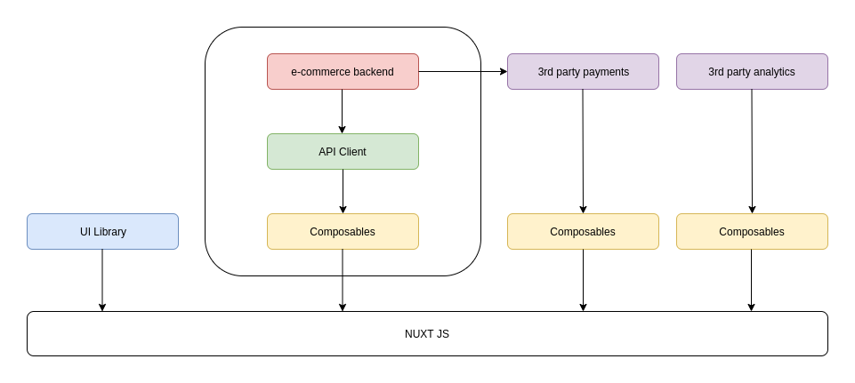

# Architecture

_Vue Storefront_ has been built upon the idea of _microservice architecture_, that is including, but not limited to _agnostic design_, _declarative protocol_, _modular packages_, and basically all the good things you can think of (with a few context) when it comes to software development and its maintenance. 

We are going to talk about the underlying architecture of _Vue Storefront_ in this section explaining 4 layers of entities, and other components with visual representation. 

[[toc]]

## Overview

_Vue Storefront_ is made up of 4 layers as follows : 


_Data Layer_ : __API Client__ - This provides a friendly abstraction layer for your e-commerce backend over network. 

_Service Layer_ : __Composables__ - This contains business logic in _Vue.js_ framework

_Presentation Layer_ : __UI Components__ - _Vue Storefront_ has already launched its sister project [Storefront UI](https://www.storefrontui.io/) helping you build your UI and theme hands down.

_Framework Layer_ : __Nuxt__ - _Nuxt_ works as a glue for all the framework components but it's optional. 

_Vue Storefront_ is a set of independent `npm` packages taking various roles of the framework. It's really up to you _how much_ of the framework you will use in your project. You can cherry-pick any combination to your advantage. 

:::tip
_Vue Storefront_ packages are standalone which allows you to use them in __any__ Vue.js enviroment so it's not a must to use Nuxt. You can use _Vue Storefront_ packages with Vue CLI or even within your custom Vue.js codebase. All you need is know how to communicate with _Vue Storefront_, which is done via interfaces over API.
:::

## Quick Run

Once you downloaded the framework from [github](https://github.com/DivanteLtd/vue-storefront/tree/next), you can build the packages you want to go with. 

For example, to go with _commercetools_, you can build your instance in project root directory just by typing : 

```bash
yarn build:ct:tools
```

Which translates into 

```bash
yarn build:core && yarn build:ct:api-client && yarn build:ct:composables
```

It sticks out a mile what it does; install `core`, `api-client` and `composables` for _commercetools_. (`ct` stands for _commercetools_ of course)


Now run the instance as follows : 

```bash
yarn dev:ct
```

Which also translates into 

```bash
cd packages/commercetools/theme && yarn dev
# also translates into
nuxt # at ./packages/commercetools/theme
```

Then you will see a screen like below : 
```bash
ℹ VSF Starting Vue Storefront Nuxt Module                                                                         15:00:53
✔ VSF Installed Composition API plugin for Vue 2                                                                  15:00:53
✔ VSF Installed VSF SSR plugin                                                                                    15:00:53
✔ VSF Installed nuxt composition api module                                                                       15:00:54
ℹ VSF Vue Storefront core development mode is on [coreDevelopment]                                                15:00:54
ℹ VSF Using raw source/ESM for @storefront-ui/vue [useRawSource]                                                  15:00:54
ℹ VSF Using raw source/ESM for @storefront-ui/shared [useRawSource]                                               15:00:54
ℹ VSF Using raw source/ESM for @vue-storefront/commercetools [useRawSource]                                       15:00:54
ℹ VSF Using raw source/ESM for @vue-storefront/core [useRawSource]                                                15:00:54
ℹ VSF Starting Theme Module                                                                                       15:00:54
ℹ VSF Watching changes in @vue-storefront/nuxt-theme-module and used platform theme directory                     15:00:54
ℹ VSF Adding theme files...                                                                                       15:00:54
✔ VSF Added 41 theme file(s) to _theme folder                                                                     15:00:54

   ╭─────────────────────────────────────────────╮
   │                                             │
   │   Nuxt.js @ v2.14.3                         │
   │                                             │
   │   ▸ Environment: development                │
   │   ▸ Rendering:   server-side                │
   │   ▸ Target:      server                     │
   │                                             │
   │   Listening: http://192.168.157.129:3000/   │
   │                                             │
   ╰─────────────────────────────────────────────╯

ℹ Preparing project for development                                                                               15:00:57
ℹ Initial build may take a while              
```
Do you notice packages loaded in the log above? They are _Nuxt Module_, _Storefront UI_, _commercetools for VSF_, and _Core_.  

Simple as that.

Now open the browser and go to the listening port; `http://192.168.157.129:3000/` in above example, you will see your shop is up and running, ready to sell anything. 

During the process, we have learned we only need to build `core`, `api-client`, and `composables`, then launch a `theme` wrapped in _Nuxt_ gluing the 3 parts just built a moment before.

To sum it up in one shot;



This picture describes more information than we just played along. 

_Vue Storefront_ is a bundle holding a set of `npm` packages as shown in a rounded rectangle in the picture. However, e-commerce platform may expand its features and communicate with 3rd party payment, analytics, or more. _Composables_ dealing with business logics for such 3rd party services can be independently created and run on its own within the package, in this case; _Nuxt_.

## API
API client is a data layer of your eCommerce integration. It provides a friendly abstraction layer over network calls to your e-commerce platform.

It expresses each network request as a declarative method like `getProduct` or `getCategory`. By having this additional layer we can hide implementation details of how we get the data which gives you freedom of introducing major changes in this layer without influencing other parts of the app.

API client by itself is a Vanilla JavaScript application and it doesn't require any frontend framework to run. It's usually not used directly in the UI and is responsible only for providing data to _Composables_.

## Theme
It is presentation layer (TBD)

## Composables
It is service layer that deals with business logic. (TBD)