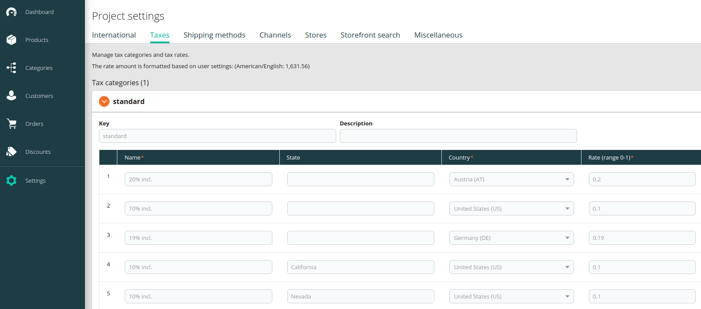
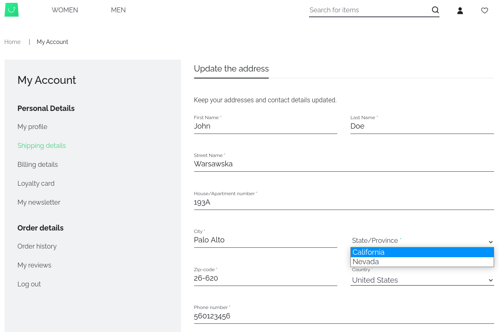
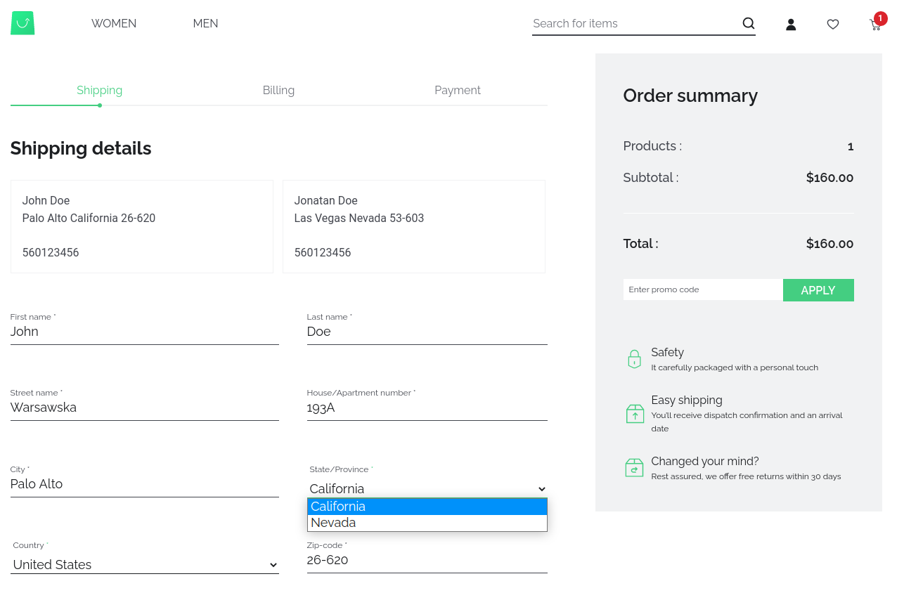

# Configuration


Commercetools configuration is located in two places:

- nuxt.config.js is a place where you're configuring properties related only to the frontend part of your application.

- middleware.config.js is a place where you're configuring the Commercetools SDK, Apollo and extensions. You will put there API keys, integration configurations, custom GraphQL queries and new API endpoints.

## Nuxt Commercetools configuration

```js
// nuxt.config.js
['@vue-storefront/commercetools/nuxt', {
  i18n: {
    useNuxtI18nConfig: true
  }
}]
```

- `useNuxtI18nConfig` - when enabled, `@vue-storefront/commercetools/nuxt` package will use `i18n` config object provided in `nuxt.config.js`. Otherwise, the `i18n` config should be passed directly to this package configuration. You can read more about it on [Internationalization](../advanced/internationalization.md) page. There are things specific to commercetools, which you can read more about below.

### Adding states for the country
In commercetools each state must have a specified tax rules. That's why we decided to have the state as a select field instead of a text one.

In order to add a support for the new state, you have to:
- Add `states` field in the desired country inside a `i18n.countries` of your `nuxt.config.js`
```js
i18n: {
  currency: 'USD',
  country: 'US',
  countries: [
    { name: 'US',
      label: 'United States',
      states: [
        'California',
        'Nevada'
      ]
    },
    // ...
  ]
}
```
- In commercetools' dashboard, open *Settings* -> *Project settings* -> *Taxes* and click **Add rate** button for new states:



After that, if you select `United States` as a country, there will be 2 available states. You can check it on Checkout's shipping & billing step and MyAccount's user shipping & billing addresses views.





## Middleware Commercetools configuration

You can read more about middleware configuration in Vue Storefront [here](../advanced/server-middleware.md#configuration)

```js
// middleware.config.js
module.exports = {
  integrations: {
    ct: {
      location: '@vue-storefront/commercetools-api/server',
      configuration: {
        api: {
          uri: 'https://<DOMAIN_NAME>.com/<PROJECT_KEY>/graphql',
          authHost: 'https://auth.sphere.io',
          projectKey: '<PROJECT_KEY>',
          clientId: '<CLIENT_ID>',
          clientSecret: '<CLIENT_SECRET>',
          scopes: [
            'manage_products:<PROJECT_KEY>',
            /* other scope rules */
          ]
        },
        currency: 'USD',
        country: 'US'
      }
    }
  }
};
```

### `api`

- `uri` - link to your Commercetools GraphQL API instance.
- `authHost` - link to Commercetools Authentication Server. It is used to request an access token from commercetools OAuth 2.0 service. To choose the nearest service, please visit [Commercetools hosts list](https://docs.commercetools.com/api/authorization)
- `projectKey` - name of your Commercetools project, i.e. `my-awesome-vsf-project`
- `clientId` - unique Commercetools Client ID. Visit [Commercetools documentation](https://docs.commercetools.com/tutorials/getting-started#creating-an-api-client) for more details about creating an API Client
- `clientSecret` - Commercetools secret API key. Visit [Commercetools documentation](https://docs.commercetools.com/tutorials/getting-started#creating-an-api-client) for more details about creating an API Client
- `scopes` - The scope constrains the endpoints to which a client has access, and whether a client has read or write access to an endpoint. Visit [Commercetools documentation](https://docs.commercetools.com/api/scopes#top) for more details about Scopes.

### `acceptLanguage`

An array of possible locales Commercetools will use. You can read more about Commercetools internationalization configuration [here](https://docs.commercetools.com/api/projects/orders-import#language-filtering)

```js
acceptLanguage: ['en-gb', 'en-us']
```

### `languageMap`

If you supply a `languageMap` during setup this will be used to map a locale to the accepted languages.

```js
languageMap: {
  'en-gb': ['en-gb', 'en-us'],
  'en-us': ['en-us', 'en-gb'],
}
```
