# Setting up a Vue Storefront store with commercetools

This document will guide you through the process of setting up a Vue Storefront store with commercetools. This guide intentionally only describes the basic working configuration to get you up and running as fast as possible. To learn more about commercetools, see the [commercetools documentation](https://docs.commercetools.com/merchant-center/).

## Prerequisites

This guide assumes you already have access to the commercetools Merchant Center and generated the Vue Storefront project.

Refer to our [Installation](/general/installation.html) guide if you don't have the Vue Storefront project yet.

## Create a new commercetools project

Log into your commercetools account and create a new project following the [Create a project](https://docs.commercetools.com/merchant-center/projects#creating-a-project) guide from commercetools. One project can provide data for multiple selling channels, but you can have more than one project with different settings and catalogs if you need it.

By default, you can only connect the Vue Storefront project to one commercetools project. However, you can modify the `middleware.config.js` and `nuxt.config.js` files to export different configurations based on environment variables. This way, you can use one Vue Storefront project for multiple commercetools projects.

## Configuring commercetools project

When you already have a project in commercetools, you can start configuring the store in the `Project settings` page in commercetools Merchant Center.

:::tip More information
For more information about the project set up in commercetools, see the [Project settings](https://docs.commercetools.com/merchant-center/project-settings) page in commercetools documentation.
:::

<center>
  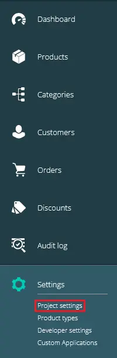
</center>

### Configuring `International` tab

When you open the `Project settings` page from the menu, you will see a few tabs at the top. The first step in configuring a commercetools store is to configure options in the `International` tab.

Start by selecting currencies available in your store:

<center>
  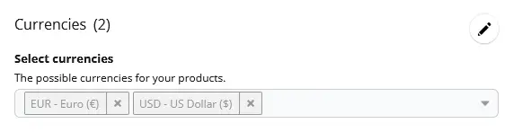
</center>

Then, select supported languages:

<center>
  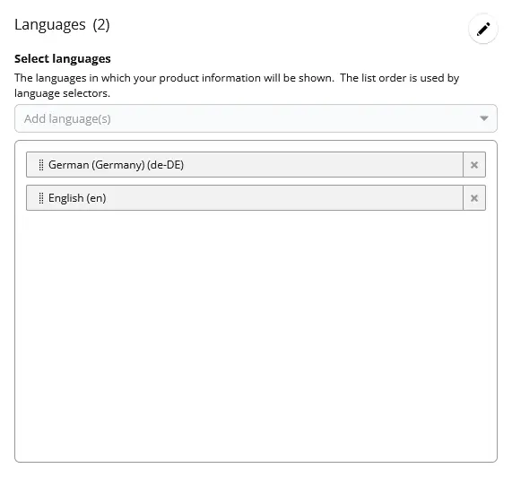
</center>

Next, select the available countries:

<center>
  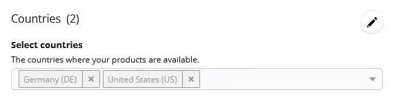
</center>

Finally, set zones. They are helpful when few countries share the same delivery costs. You need to configure at least one shipping zone to be able to set up shipping methods later.

<center>
  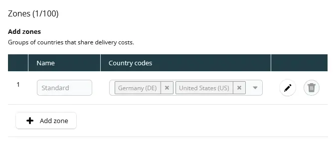
</center>

### Configuring `Taxes` tab

In the `Taxes` tab on the `Project settings` page, you can configure tax rates for the countries configured in the `International` tab.

<center>
  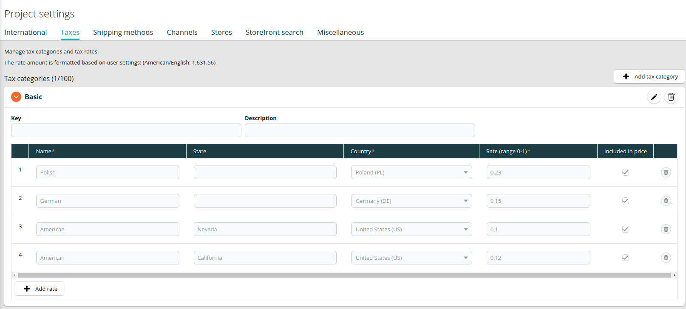
</center>

### Configuring `Shipping methods` tab

You can add a shipping method in the `Shipping methods` tab on the `Project settings` page. First, select if the price will be fixed or tiered. Then, enter specific methods for each zone and currency.

<center>
  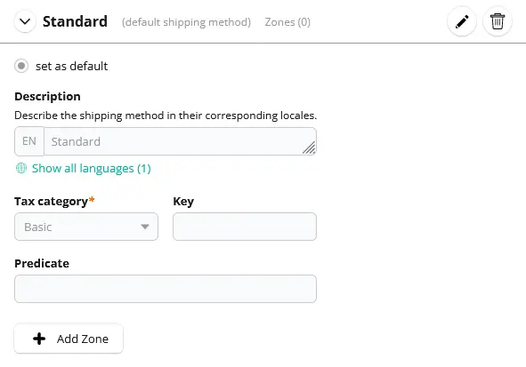
</center>

## Adding a new category

Categories allow you to organize the products in groups and make them easy to find by the customer.

:::tip More information
For more information about categories, see the [Modeling Categories](https://docs.commercetools.com/tutorials/product-modeling/categories) page in commercetools documentation.
:::

To create a category, go to the `Add category` page from the sidebar menu. 

<center>
  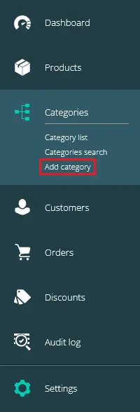
</center>

Enter the name and category order.

<center>
  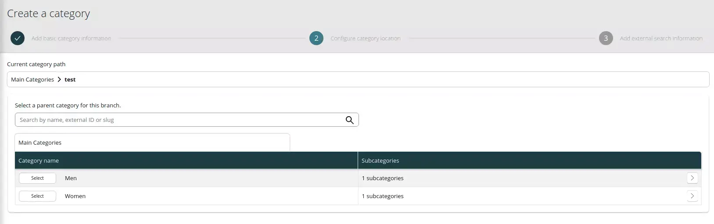
</center>

If applicable, select the parent category to which this category belongs.

<center>
  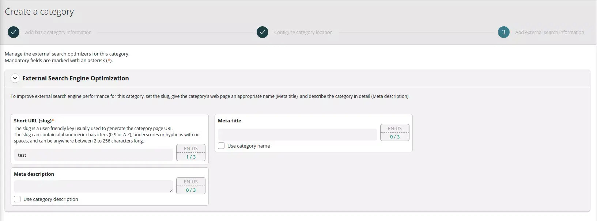
</center>

Enter the category slug. It will be part of the URL for this category.

<center>
  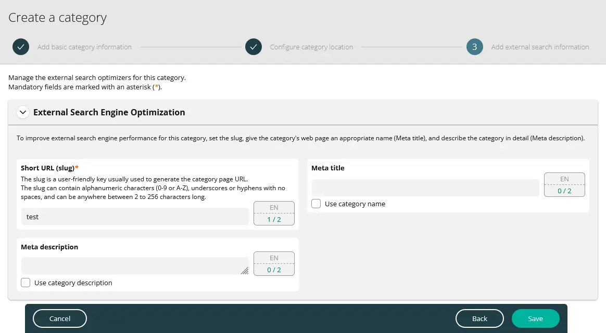
</center>

:::warning 
You have to create a category structure with at least two levels to display the category page in the Vue Storefront project correctly.
:::

You can see your categories in the `categories search` menu:

<center>
  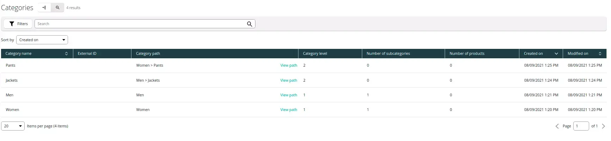
</center>

## Adding a new product type

Before we can add any new product in commercetools, we need at least one product type. Product types are templates with specific attributes for products of the same type.

:::tip More information
For more information about product types, see the [Modeling Product Types and Attributes](https://docs.commercetools.com/tutorials/product-modeling/product-types) page in commercetools documentation.
:::

To create a product type, go to the `Product types` page from the sidebar menu and click the `Add product type` button.

<center>
  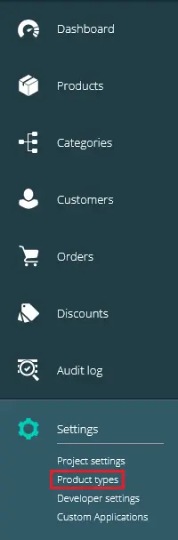
</center>

Enter name and description and click the `Save` button. Without saving, you won't be able to add attributes in the next step.

<center>
  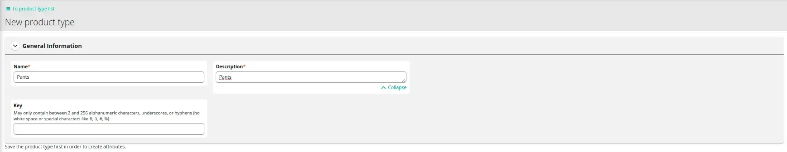
</center>


Click the `Add an attribute` button and enter the name, label, constraints, and type fields.

<center>
  
</center>

## Adding a new product

After creating at least one product type, you can add a new product.

:::tip More information
For more information about products, see the [Modeling Products](https://docs.commercetools.com/tutorials/product-modeling/products) page in the commercetools documentation.
:::

To create a product, go to the `Add product` page.

<center>
  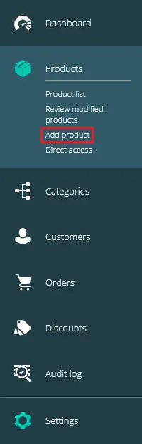
</center>

Start by selecting the product type.

<center>
  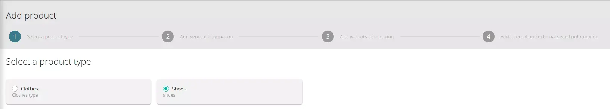
</center>

Type the name and assign the tax category.

<center>
  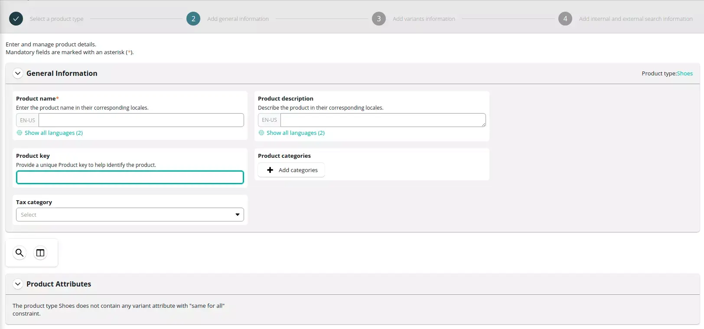
</center>

Click the `Add variant` button and add at least one variant of the product with attributes and SKU number.

<center>
  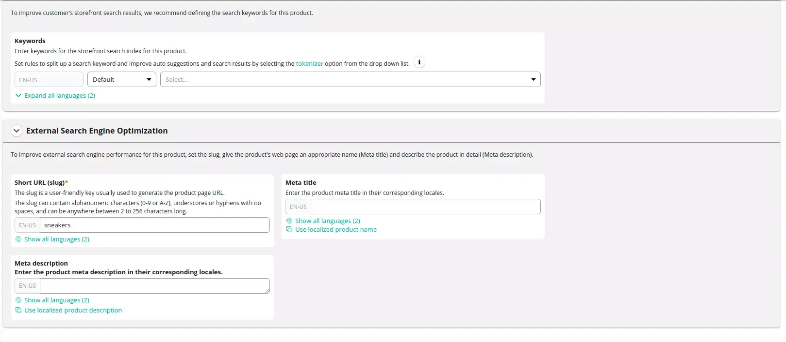
</center>

Enter a slug, keywords, and metadata to optimize searching. Once you are finished, click the `Save` button.

<center>
  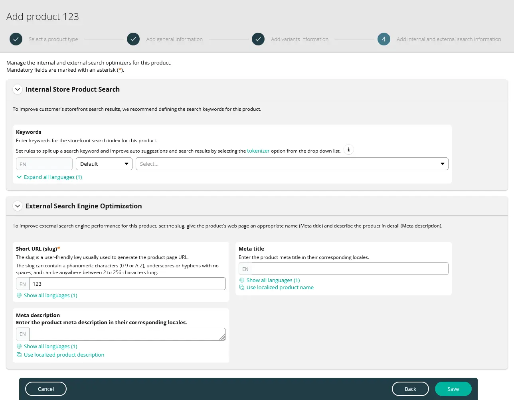
</center>

Once the product is saved and you are redirected to the product summary page, change product status to `Published` in the top right part of the product screen.

<center>
  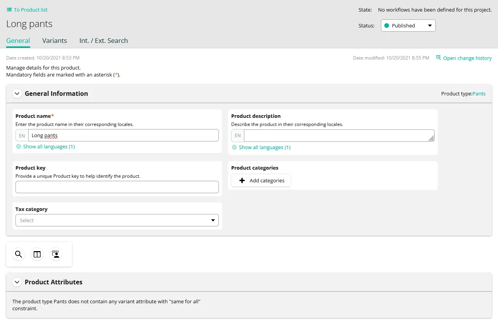
</center>

### Creating an API client

With the commercetools already configured, we can connect it to the Vue Storefront application. To do so, we need to generate two API clients.

Go to the `Developer settings` page.

<center>
  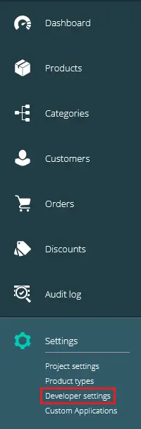
</center>

Click the `Create new API client` button and enter the `name` for the first API client. The application will use this API client to generate an access token for guests and customers visiting your shop. Then in the `Scopes` section, select the `Mobile & single-page application client` option from the list of available templates. Additionally, select the `Stores` checkbox in the `View` column. The image below shows which permissions you should select.

:::tip More information
For more information about scopes, see the [Scopes](https://docs.commercetools.com/api/scopes) page in the commercetools documentation.
:::

<center>
  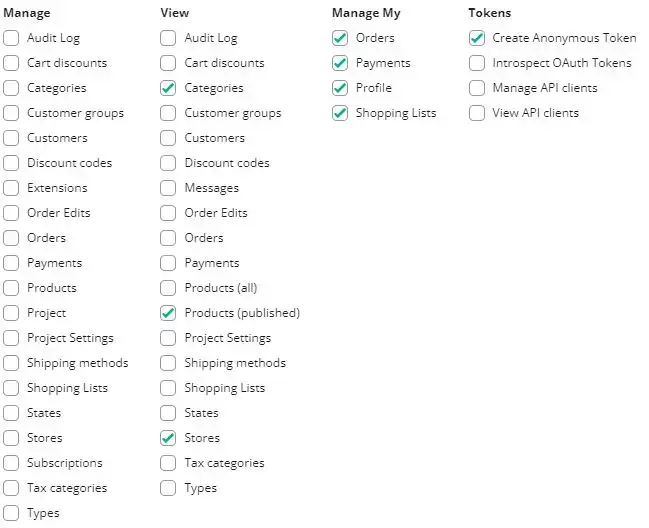
</center>

When you click on the `Create API client` button, you will see all the credentials. **They are only displayed once, so you need to store them securely.** You can also download them in the format you need.

<center>
  
</center>

Repeat the same process, but this time only select the `Customers` and `Products` permissions from the `Manage` column. The application will use this API client to generate access tokens used by the Server Middleware to perform operations that require higher permissions than what regular guests and customers should have access to.

<center>
  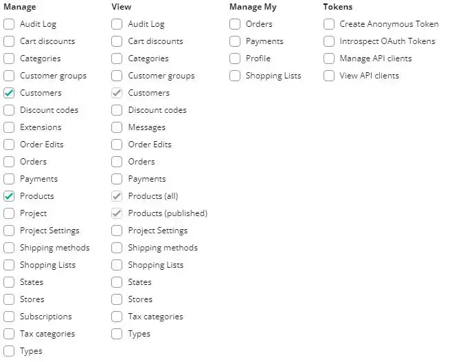
</center>

## Configuring commercetools integration in Vue Storefront

Open the `middleware.config.js` file in your Vue Storefront project. Inside of the `ct` and `ctf` configuration objects, you will find objects named `api` and `serverApi`. Replace the values in all of them with the values displayed after creating an API client, where `api` should hold values from the first API client (customer) and `serverApi` from the second API client (server).

Make sure to replace all parts starting with `<` and endpoint with `>`, like `<PROJECT_NAME>`, etc.

For more information about available configuration options refer to the [Configuration](./configuration.md) page.

```js{8-25,27-35,42-57}
// middleware.config.js

module.exports = {
  integrations: {
    ct: {
      location: '@vue-storefront/commercetools-api/server',
      configuration: {
        // Customer API-client
        api: {
          uri: 'https://api.commercetools.com/<PROJECT_NAME>/graphql',
          authHost: 'https://auth.<REGION>.<PROVIDER>.commercetools.com/',
          projectKey: '<PROJECT_NAME>',
          clientId: '<CLIENT_ID>',
          clientSecret: '<CLIENT_SECRET>',
          scopes: [
            'create_anonymous_token:<PROJECT_NAME>',
            'manage_my_profile:<PROJECT_NAME>',
            'view_categories:<PROJECT_NAME>',
            'manage_my_payments:<PROJECT_NAME>',
            'manage_my_orders:<PROJECT_NAME>',
            'manage_my_shopping_lists:<PROJECT_NAME>',
            'view_published_products:<PROJECT_NAME>',
            'view_stores:<PROJECT_NAME>'
          ],
        },

        // Server API-client
        serverApi: {
          clientId: '<CLIENT_ID>',
          clientSecret: '<CLIENT_SECRET>',
          scopes: [
            'manage_customers:<PROJECT_NAME>',
            'manage_products:<PROJECT_NAME>'
          ]
        }
      }
    },

    ctf: {
      location: '@vsf-enterprise/ct-faceting/server',
      configuration: {
        // Customer API-client
        api: {
          authHost: 'https://auth.<REGION>.<PROVIDER>.commercetools.com/',
          projectKey: '<PROJECT_NAME>',
          clientId: '<CLIENT_ID>',
          clientSecret: '<CLIENT_SECRET>',
          scopes: [
            'create_anonymous_token:<PROJECT_NAME>',
            'manage_my_profile:<PROJECT_NAME>',
            'view_categories:<PROJECT_NAME>',
            'manage_my_payments:<PROJECT_NAME>',
            'manage_my_orders:<PROJECT_NAME>',
            'manage_my_shopping_lists:<PROJECT_NAME>',
            'view_published_products:<PROJECT_NAME>',
            'view_stores:<PROJECT_NAME>'
          ]
        }
        faceting: {
          host: 'https://api.commercetools.com'
        }
      }
    }
  }
};
```

The next step is to set up the internationalization options in the `nuxt.config.js` file. You should set up the countries, currencies, and locales precisely the same as in your commercetools project. It's common to forget, e.g., that `en` is not the same as `en-US`. 


```js
// nuxt.config.js

module.exports = {
  i18n: {
    currency: 'USD',
    country: 'US',
    countries: [
      { name: 'US', label: 'United States' },
      { name: 'DE', label: 'Germany' }
    ],
    currencies: [
      { name: 'USD', label: 'Dollar' },
      { name: 'EUR', label: 'Euro' }
    ],
    locales: [
      { code: 'en', label: 'English', file: 'en.js', iso: 'en' },
      { code: 'de-DE', label: 'German', file: 'de.js', iso: 'de' },
    ]
  }
};
```

Now in the terminal, go to the Vue Storefront project directory and start the application:

```sh
yarn dev
```

If you followed all the previous steps, you should see your project working, filled with data you previously set up in your commercetools project.
