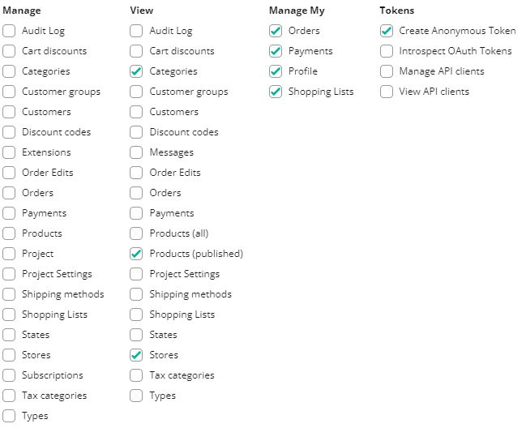
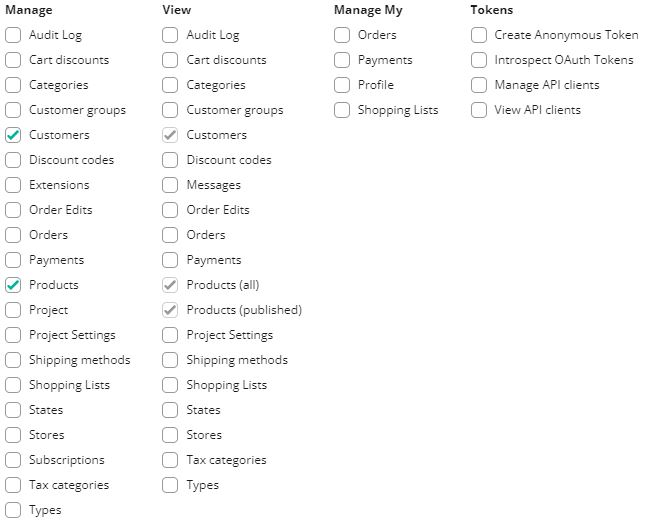

# Upgrading to 1.3.2

## Introduction

In the 1.3.2 release, we focused on improving security by limiting permissions given to the customers to the bare minimum. This release doesn't include breaking changes, but we **HIGHLY** recommend applying the changes described below to your projects.

## Changes

In the past, all requests sent to the commercetools included customer's access token created with scopes defined in the `middleware.config.js` file. If the customer didn't have permission to access a given resource, commercetools would return an error. It sounds logical - you can't access or operate the data if you don't have permission.

Unfortunately, some operations require `manage_*` scopes. For example:

- resetting user password requires `manage_customers` scope,
- adding product reviews requires `manage_products` scope.

Giving these permissions to the customer would allow them to access and modify all customers and products in your commercetools project.

For this reason, we introduced a new key named `serverApi` to the commercetools middleware configuration. You can use it to pass new server-specific API client credentials that middleware will use instead of customers API client for selected operations that require `manage_*` permissions.

```javascript{11-22,25-30}
// middleware.config.js
module.exports = {
  integrations: {
    ct: {
      location: '@vue-storefront/commercetools-api/server',
      configuration: {
        api: {
          uri: 'https://api.commercetools.com/PROJECT_KEY/graphql',
          authHost: 'https://auth.sphere.io',
          projectKey: 'PROJECT_KEY',
          clientId: 'CLIENT_ID', // Customer API client ID
          clientSecret: 'CLIENT_SECRET', // Customer API client secret
          scopes: [
            'create_anonymous_token:PROJECT_KEY',
            'manage_my_profile:PROJECT_KEY',
            'view_categories:PROJECT_KEY',
            'manage_my_payments:PROJECT_KEY',
            'manage_my_orders:PROJECT_KEY',
            'manage_my_shopping_lists:PROJECT_KEY',
            'view_published_products:PROJECT_KEY',
            'view_stores:PROJECT_KEY'
          ]
        },
        serverApi: {
          clientId: 'SERVER_ID', // Server API client ID
          clientSecret: 'SERVER_SECRET', // Server API client secret
          scopes: [
            'manage_customers:PROJECT_KEY',
            'manage_products:PROJECT_KEY'
          ]
        }
      }
    }
  }
};
```

API client used in the `serverApi` section can only have the `manage_customers` and `manage_products` scopes.
Alternatively, you can use just the `manage_project` scope, but keep in mind that this gives Vue Storefront unlimited access to everything in your project. When dealing with permissions, less is always better ;)

:::tip Use two separate API clients for `api` and `serverApi`
While it's possible to use the same API client in `api` and `serverApi`, but will different scopes, we recommend creating two separate API clients.
:::

### Recommended customer scopes

The image below shows a list of recommended scopes for the API client configured in the `api` section should have.



### Recommended server scopes

The image below shows a list of recommended scopes for the API client configured in the `serverApi` section should have.


