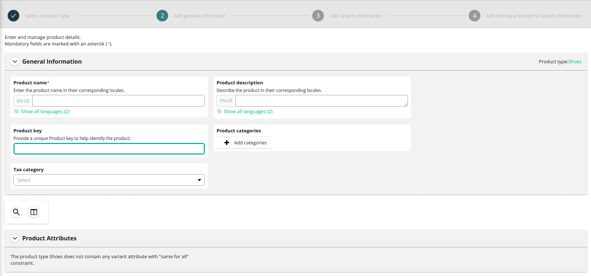

# How to setup commercetools store with Vue Storefront?

This short description is here to guide you all the way to create simple working store based on the commercetools integration.
First you need to go prepare commercetools instance in Merchant Center. After signing up following [this guide](https://docs.commercetools.com/merchant-center/accounts) you can start preparing your project.

## Commercetools settings

Project is the set of data and store configuration which allows you to manage and provide input for VSF Next to display it in proper way. You can have more than one project with different settings and independent data. One project can provide data for multiple selling channels.
In order to create one, you need to add it in 'manage projects' menu by setting name, key and organization.

<center>
  
</center>

For further information please see the [following guide](https://docs.commercetools.com/merchant-center/projects#creating-a-project)

Preparing configuration for your store consist of few steps to make it ready to use with VSF Next  
In 'Project settings' menu you need to define basic settings:
<center>
  
</center>

##  International configuration

Open the `Settings > Project settings` menu and select currencies available in your store:

<center>
  
</center>

Then, select supported languages:

<center>
  
</center>

Next, select the available countries:

<center>
  
</center>

Finally, set zones. Zones are helpful when few countries share the same delivery costs. You need to configure at least one shipping zone to be able to set up shipping methods later.

<center>
  
</center>

## Taxes configuration

Open the `Settings > Project settings` menu. In the `Taxes` tab, you can configure tax rates for the countries configured in the 'International' tab.

<center>
  
</center>

## Shipping methods configuration

To add a shipping method, open the `Settings > Project settings` menu and select the `Shipping methods` tab. First, select if the price will be fixed (one per currency) or tiered (depending on cart value, classification, or score). For more details, see the [Shipping methods](https://docs.commercetools.com/merchant-center/project-settings#shipping-methods) page in commercetools documentation.

Then, enter specific methods for each zone and currency:

<center>
  
</center>

## Adding a new category

Categories allow to organize the products in groups and make them easy to find by the customer. See the [Modeling Categories](https://docs.commercetools.com/tutorials/product-modeling/categories) page to know more about categorizing items in your store.

1. Choose `add category` from the sidebar menu. 
  <center>
    
  </center>

2. Enter the name, and category order.
  <center>
    
  </center>
3. If applicable, select the parent category to which this category belongs.
  <center>
    
  </center>

4. Enter the slug. It will be part of the URL for this category.
  <center>
    
  </center>

Please provide category structure with at least two levels, in order to show category page properly (one is on top, inside main menu and second level categories are shown in menu on the left).

You can see your categories in `categories search` menu:
  <center>
    
  </center>

## Adding a new product type

To create any product in commercetools, at least one product type need to be set. It is the sort of template with certain attributes which is used as a base for the product.
Creating a product type involves changes in `Product types` menu:

  <center>
    
  </center>

- providing name and description

  <center>
    
  </center>
For our purposes you don't need to setup product attributes, but when creating real life project attributes are necessary to configure products needed for buying process.  

<!-- - and in folowing step clicking on 'add attribute' and filling name, label, constraints, and type
  <center>
    
  </center> -->

## Adding a new product

After creating at least one product type, you can add a new product. You can read more about them on the [Modeling Products](https://docs.commercetools.com/tutorials/product-modeling/products) page.

1. Go to the `Products` page. Click the `Add product` button and select the type.
  <center>
    
  </center>
2. Next enter the name, assign tax category (which you previously set) and add to proper category 
  <center>
    
  </center>
3. Add at least one variant of the product with attribute and SKU number.
  <center>
    
  </center>
4. Enter a slug, keywords, and metadata to optimize searching.
  <center>
    
  </center>

### API settings

The Last important step is to generate credentials for your project to connect both tools.
Go to the `developer settings` and click `Create new API client` button and choose manage -> Project scope, but please keep in mind that it use entire API for the project, so it is not recommended for production use. In that case, select only scopes that are needed.
<center>
  
</center>


<center>
  
</center>


If you need more information about scopes please see [documentation](https://docs.commercetools.com/api/scopes).
When you click on create API you will see all the credentials. They are only displayed once, so you need to store them sacurely. You can download them in the format you need.

<center>
  
</center>

Now let's move to front-end side.

## Configuring commercetools integration in Vue Storefront

All generated credentials should be used in `middleware.config.js` in `ct` config object inside `integrations`:

```js
    ct: {
      location: '@vue-storefront/commercetools-api/server',
      configuration: {
        api: {
          uri: 'https://<SHOP_DOMAIN>.com/vsf-ct-dev/graphql',
          authHost: 'https://auth.sphere.io',
          projectKey: 'vsf-ct-dev',
          clientId: '<CLIENT_ID>',
          clientSecret: '<CLIENT_SECRET>',
          scopes: [
            //* scopes */
          ]
        },
        currency: 'USD',
        country: 'US'
      }
    }
```

For more information about available configuration options refer to the [Configuration](./configuration.md) page.