# How to setup commercetools store with Vue Storefront?

This document will guide you through the process of setting up a store based on our commercetools integration.

:::tip There's more
This document is focused on setting up a basic working store using Vue Storefront and commercetools. If you want to learn more see the [commercetools documentation](https://docs.commercetools.com/merchant-center/).
:::

## Create a new commercetools projects

Log into your commercetools account and [create a new project](https://docs.commercetools.com/merchant-center/projects#creating-a-project). One project can provide data for multiple selling channels, but you can have more than one project with different settings and catalogs if you need. 

For further information on creating and managing commercetools projects, see the [Projects](https://docs.commercetools.com/merchant-center/projects) guide in the commercetools documentation.

## Project settings

When you already have a project in commercetools, you can configure your store in few steps described below.

Let's start by defining a basic store configuration in the `Project settings` menu in commercetools Merchant Center.

<center>
  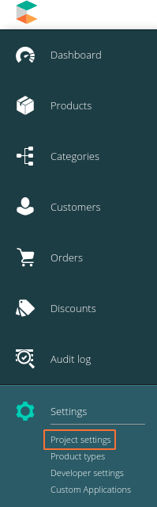
</center>

### International configuration

Select currencies available in your store:

<center>
  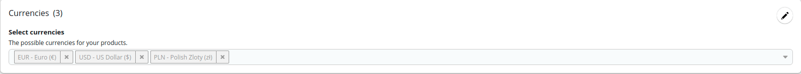
</center>

Then, select supported languages:

<center>
  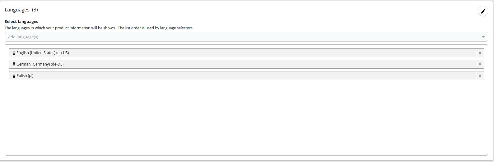
</center>

Next, select the available countries:

<center>
  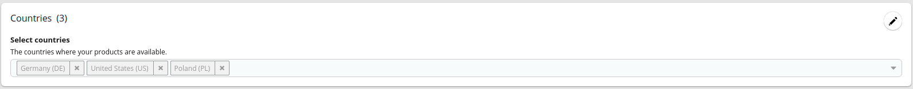
</center>

Finally, set zones. Zones are helpful when few countries share the same delivery costs. You need to configure at least one shipping zone to be able to set up shipping methods later.

<center>
  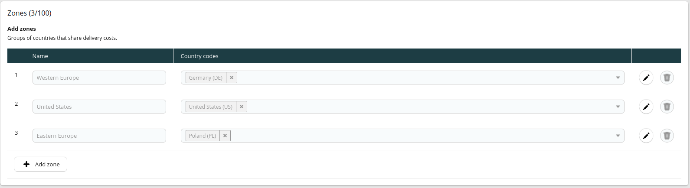
</center>

### Taxes configuration

Open the `Settings > Project settings` menu. In the `Taxes` tab, you can configure tax rates for the countries configured in the `International` tab.

<center>
  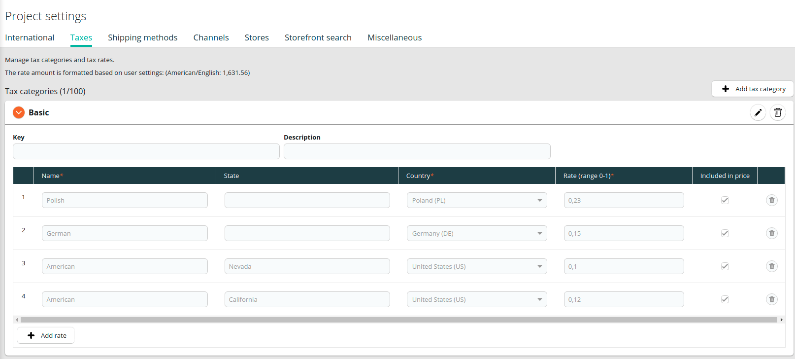
</center>

### Shipping methods configuration

To add a shipping method, open the `Settings > Project settings` menu and select the `Shipping methods` tab. First, select if the price will be fixed (one per currency) or tiered (depending on cart value, classification, or score). For more details, see the [Shipping methods](https://docs.commercetools.com/merchant-center/project-settings#shipping-methods) page in commercetools documentation.

Then, enter specific methods for each zone and currency:

<center>
  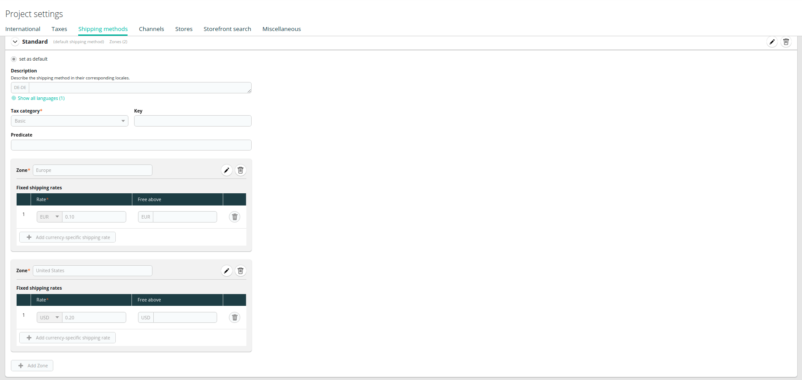
</center>

## Adding a new category

Categories allow to organize the products in groups and make them easy to find by the customer. See the [Modeling Categories](https://docs.commercetools.com/tutorials/product-modeling/categories) page to know more about categorizing items in your store.
In order to create a category you need to:

1. Choose `add category` from the sidebar menu. 

  <center>
    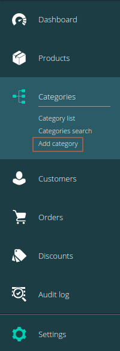
  </center>

2. Enter the name, and category order.

  <center>
    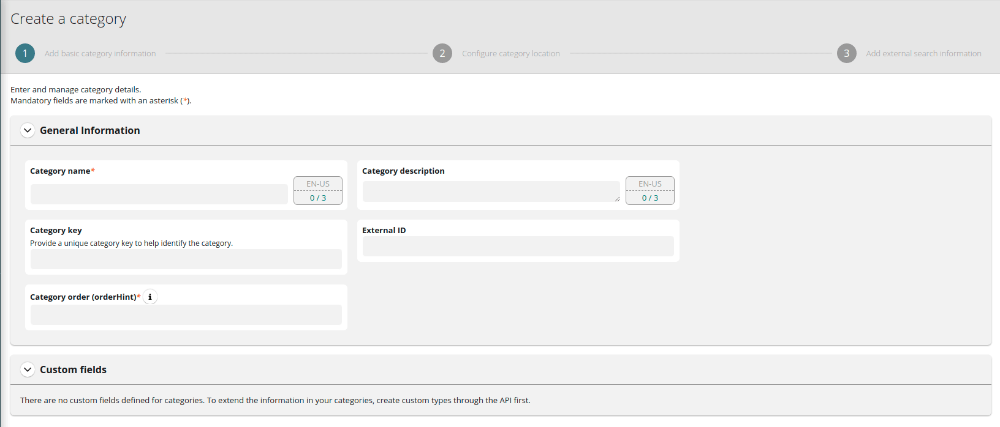
  </center>

3. If applicable, select the parent category to which this category belongs.

  <center>
    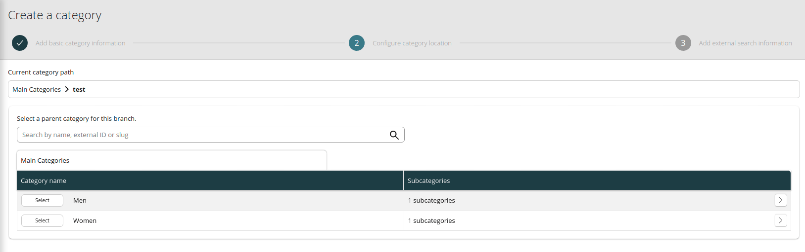
  </center>

4. Enter the slug. It will be part of the URL for this category.

  <center>
    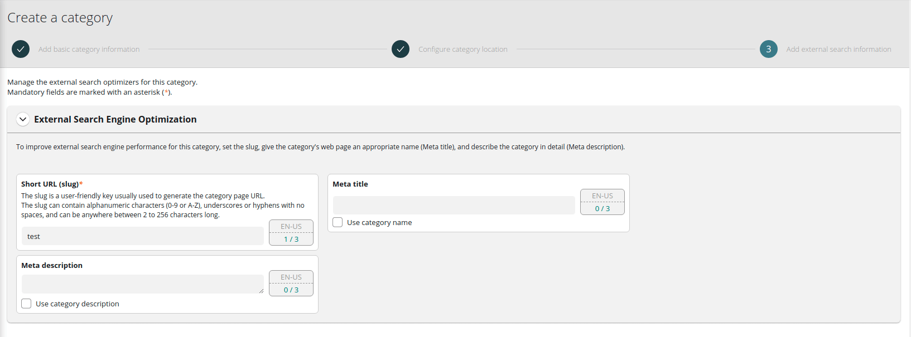
  </center>

Please provide category structure with at least two levels, in order to show category page properly in VSF 2 project (one is on top, inside main menu and second level categories are shown in menu on the left).

You can see your categories in `categories search` menu:
  <center>
    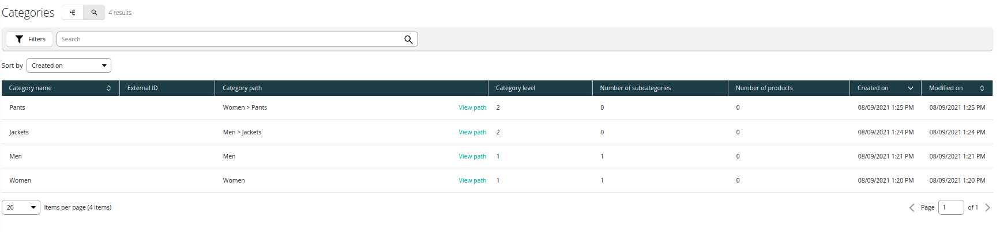
  </center>

## Adding a new product type

To create any product in commercetools, at least one product type needs to be set. It is a template with specific attributes for products of the same type. You can read more about them on the [Modeling Product Types and Attributes](https://docs.commercetools.com/tutorials/product-modeling/product-types) page. Creating a product type involves changes in `Product types` menu:

<center>
  
</center>

1. Enter name and description.

  <center>
    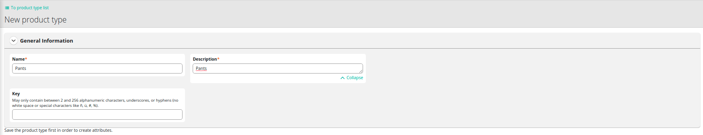
  </center>


2. Click the `Add an attribute` button and enter the name, label, constraints, and type fields.

  <center>
    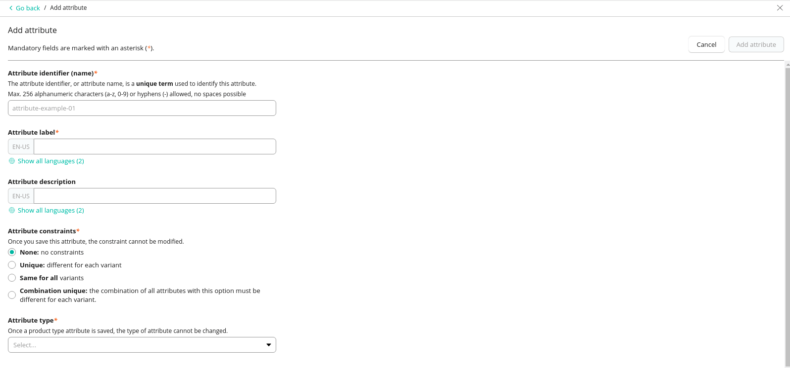
  </center>

## Adding a new product

After creating at least one product type, you can add a new product. You can read more about them on the [Modeling Products](https://docs.commercetools.com/tutorials/product-modeling/products) page.

1. Go to the `Products` page. 

  <center>
    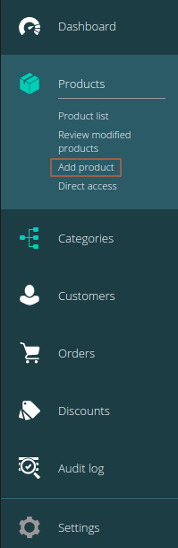
  </center>

2. Click the `Add product` button and select the type.

  <center>
    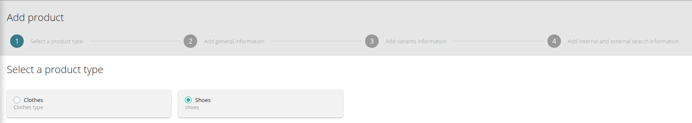
  </center>

3. Type the name and assign the tax category.

  <center>
    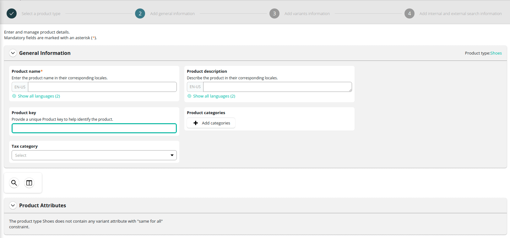
  </center>

4. Add at least one variant of the product with attribute and SKU number.

  <center>
    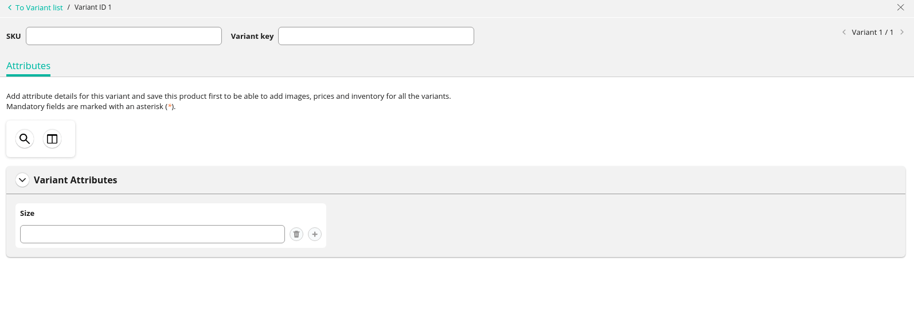
  </center>

5. Enter a slug, keywords, and metadata to optimize searching.

  <center>
    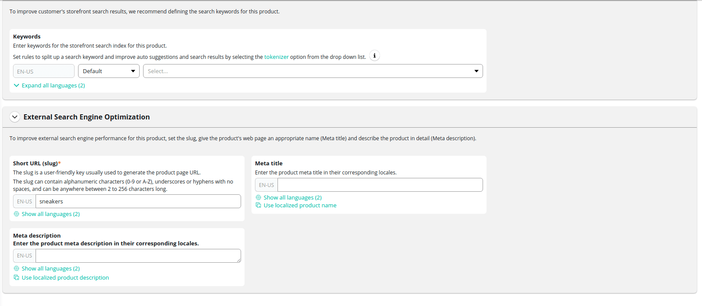
  </center>

6. Change product status to `Published` in the top right part of the product screen.

  <center>
    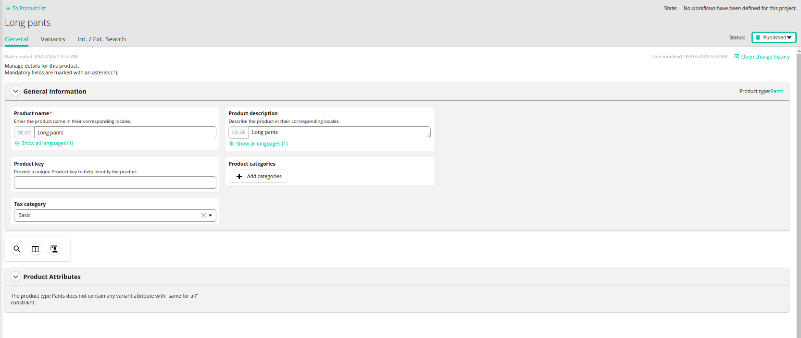
  </center>


### API settings

The last important step is to generate credentials for your project to connect both tools.
Go to the `developer settings` and click `Create new API client` button. After filling the `name` field choose `Mobile & single-page application client` in scopes.

<center>
  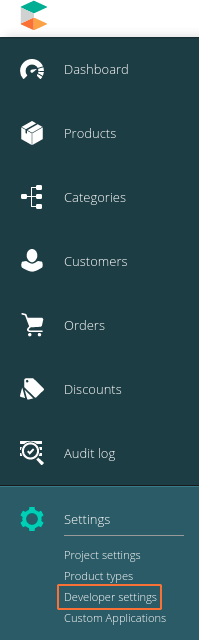
</center>


<center>
  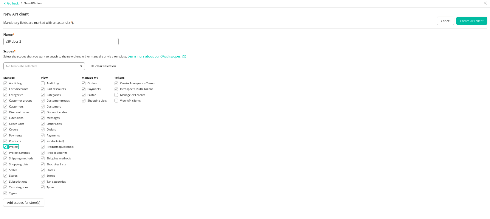
</center>


If you need more information about scopes please see [documentation](https://docs.commercetools.com/api/scopes).
When you click on create API you will see all the credentials. They are only displayed once, so you need to store them securely. You can download them in the format you need.

<center>
  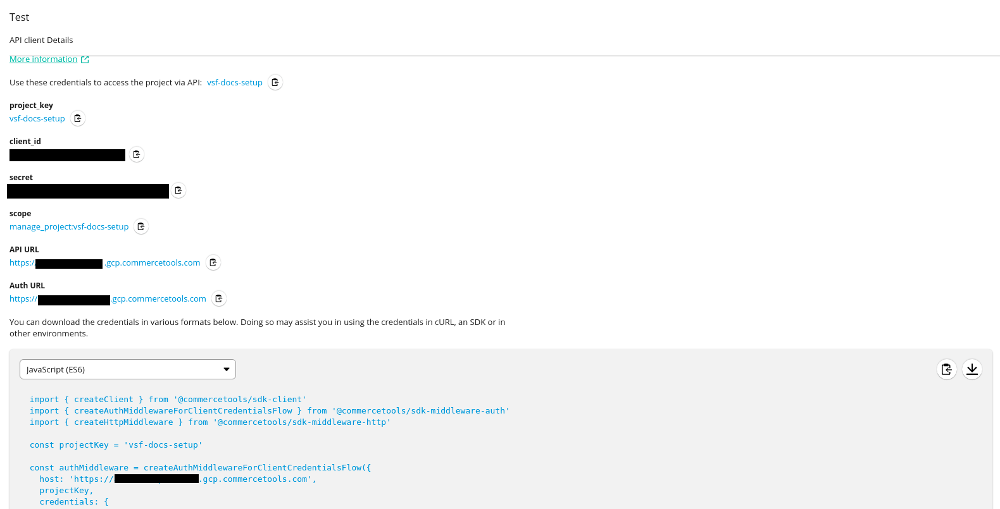
</center>

Now let's move to front-end side.

## Configuring commercetools integration in Vue Storefront

Moving to front-end site of your project, first the new VSF project should be run:

```sh
npx @vue-storefront/cli init
```
During initialization you should choose your project name and integration you use, in these case `Commercetools`.

<center>
  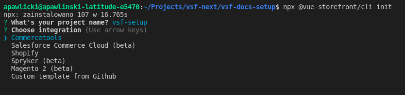
</center>

After entering your project catalogue, fetch all dependencies: 

```sh
cd <PROJECT_NAME>
yarn install
```

And you can now run the project with following command: 

```sh
yarn dev
```

But what you will see is the default project, because we didn't previously connect prepared Commercetools project with VSF. 
To do it, begin with credentials generated in API settings step above. They should replace default ones in `middleware.config.js` file in `ct` config object inside `integrations` and `serverApi` properties. 

```js
  integrations: {
    ct: {
      location: '@vue-storefront/commercetools-api/server',
      configuration: {
        api: {
          uri: 'https://<SHOP_DOMAIN>.com/<PROJECT_NAME>/graphql',
          authHost: 'https://<SHOP_DOMAIN>.com/<PROJECT_NAME>',
          projectKey: '<PROJECT_NAME>',
          clientId: '<CLIENT_ID>',
          clientSecret: '<CLIENT_SECRET>',
          scopes: [
            'create_anonymous_token:<PROJECT_NAME>',
            'view_categories:<PROJECT_NAME>', 
            'manage_my_payments:<PROJECT_NAME>', 
            'view_published_products:<PROJECT_NAME>',
            'manage_my_shopping_lists:<PROJECT_NAME>', 
            'manage_my_orders:<PROJECT_NAME>',
            'manage_my_profile:<PROJECT_NAME>'
          ],
        },
        serverApi: {
          clientId: '<CLIENT_ID>',
          clientSecret: '<CLIENT_SECRET>',
          scopes: [
            'create_anonymous_token:<PROJECT_NAME>',
            'view_categories:<PROJECT_NAME>', 
            'manage_my_payments:<PROJECT_NAME>', 
            'view_published_products:<PROJECT_NAME>',
            'manage_my_shopping_lists:<PROJECT_NAME>', 
            'manage_my_orders:<PROJECT_NAME>',
            'manage_my_profile:<PROJECT_NAME>'
          ]
        },
        currency: 'USD',
        country: 'US'
      }
    }
  }
```

For more information about available configuration options refer to the [Configuration](./configuration.md) page.

The next step is to setup `nuxt.config.js` file properly. The countries, currencies and locales should be setup simiralry like in Commercetools project, in our case: 

```js
  i18n: {
    currency: 'USD',
    country: 'US',
    countries: [
      { name: 'US',
        label: 'United States'
      },
      { name: 'DE',
        label: 'Germany' },
    ],
    currencies: [
      { name: 'USD',
        label: 'Dollar' },,
      { name: 'EUR',
        label: 'Euro' },
      
    ],
    locales: [
      {
        code: 'en',
        label: 'English',
        file: 'en.js',
        iso: 'en'
      },
      {
        code: 'de-DE',
        label: 'German',
        file: 'de.js',
        iso: 'de'
      },
    ],
  ```


:::tip
Take a closer look at above configuration and make sure all locales are set exactly like in Commercetools Merchant Center, because it's common mistake to forgot e.g. that `en` is not the same as `en-US`. 
:::


Now you can rebuild your project and run again:

```sh
yarn build
yarn dev
```

  If you follow all the previous steps you should see your project working, filled with data that you prevously setup in Commercetools project:

- on home page: 

  <center>
    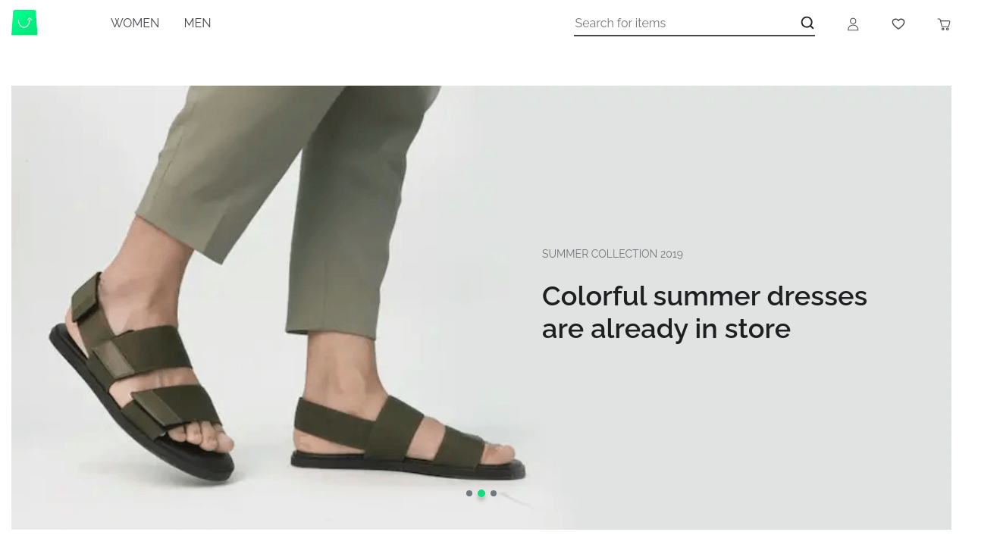
  </center>

- on category page:

  <center>
    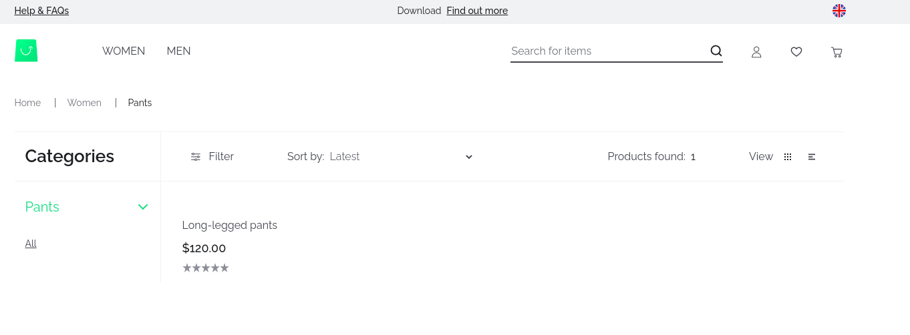
  </center>


- and on product detail page:

  <center>
    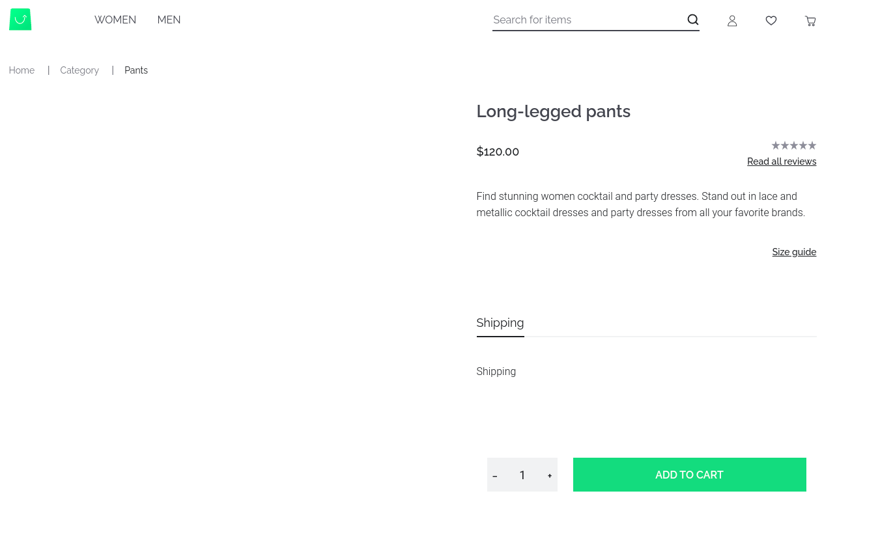
  </center>

It is just the beginning of your VSF Next store based on Commercetools integration. Now you can customize it according to your needs. 

## Configuring commercetools integration with enterprise version of Vue Storefront

Using enterprise version of commercetools integration requires changes in `middleware.config.js`. Add properties regarding extesions and separate configuration for faceting: 

```js
  integrations: {
    ct: {
      location: '@vue-storefront/commercetools-api/server',
      // extensions property to add in enterprise version
      extensions: existing => existing.concat('@vsf-enterprise/commercetools/extensions'),
      configuration: {
        api: {
          uri: 'https://<SHOP_DOMAIN>.com/<PROJECT_NAME>/graphql',
          authHost: 'https://<SHOP_DOMAIN>.com/<PROJECT_NAME>',
          projectKey: '<PROJECT_NAME>',
          clientId: '<CLIENT_ID>',
          clientSecret: '<CLIENT_SECRET>',
          scopes: [
            // like in open source configuration
          ],
        },
        serverApi: {
          clientId: '<CLIENT_ID>',
          clientSecret: '<CLIENT_SECRET>',
          scopes: [
            // like in open source configuration
          ]
        },
        currency: 'USD',
        country: 'US'
      }
    }
    // faceting configuration for enterprise version
    ctf: {
      location: '@vsf-enterprise/ct-faceting/server',
      configuration: {
        api: {
          authHost: 'https://<SHOP_DOMAIN>.com/<PROJECT_NAME',
          projectKey: '<PROJECT_NAME>',
          clientId: '<CLIENT_ID>',
          clientSecret: '<CLIENT_SECRET>',
          scopes: [
            // the same like above
          ]
        },
        faceting: {
          host: 'https://api.commercetools.com'
        },
      }
    },
  }
```
And one more change needed is adding `faceting` to `buildModules` in `nuxt.config.js`, like this: 

```js 
buildModules: [
    '@nuxt/typescript-build',
    '@nuxtjs/style-resources',
    '@nuxtjs/pwa',
    ['@vue-storefront/nuxt', {
      coreDevelopment: true,
      useRawSource: {
        dev: [
          '@vue-storefront/commercetools',
          '@vue-storefront/core'
        ],
        prod: [
          '@vue-storefront/commercetools',
          '@vue-storefront/core'
        ]
      }
    }],
    ['@vue-storefront/nuxt-theme'],
    ['@vue-storefront/commercetools/nuxt', {
      i18n: { useNuxtI18nConfig: true }
    }],
    // adding faceting feature from enterprise package
    ['@vsf-enterprise/ct-faceting/nuxt', {
      apiConfigModule: '@vsf-enterprise/commercetools/nuxt'
    }],
  ]
  ```

Other configuration changes depend on what integrations you use along with commercetools.  
