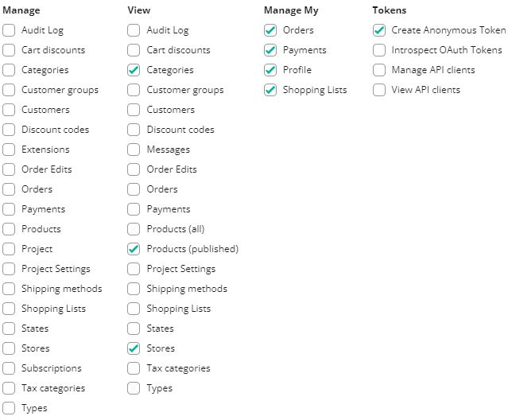
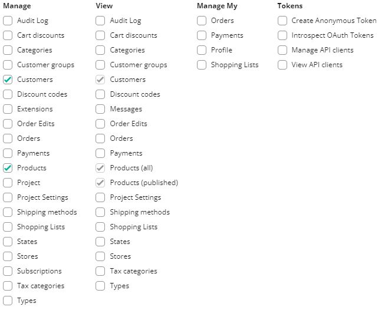

# How to setup commercetools store with Vue Storefront?

This document will guide you through the process of setting up a store based on our commercetools integration. This guide is only focused on setting up a basic working store using Vue Storefront and commercetools. If you want to learn about the commercetools itself, see the [commercetools documentation](https://docs.commercetools.com/merchant-center/).

## Create a new commercetools project

Log into your commercetools account and create a new project following the [Create a project](https://docs.commercetools.com/merchant-center/projects#creating-a-project) guide from commercetools. One project can provide data for multiple selling channels, but you can have more than one project with different settings and catalogs if you need. 

## Configuring commercetools project

When you already have a project in commercetools, you can start defining a basic store configuration in the `Project settings` menu in commercetools Merchant Center.

<center>
  
</center>

### Configuring `International` tab

First step in configuring a commercetools store is to configure options in the `International` tab.

Start by selecting currencies available in your store:

<center>
  
</center>

Then, select supported languages:

<center>
  
</center>

Next, select the available countries:

<center>
  
</center>

Finally, set zones which are helpful when few countries share the same delivery costs. You need to configure at least one shipping zone to be able to set up shipping methods later.

<center>
  
</center>

### Configuring `Taxes` tab

Open the `Settings > Project settings` menu. In the `Taxes` tab, you can configure tax rates for the countries configured in the `International` tab.

<center>
  
</center>

### Configuring `Shipping methods` tab

To add a shipping method, open the `Settings > Project settings` menu and select the `Shipping methods` tab. First, select if the price will be fixed or tiered. Then, enter specific methods for each zone and currency.

For more details, see the [Shipping methods](https://docs.commercetools.com/merchant-center/project-settings#shipping-methods) page in commercetools documentation.

<center>
  
</center>

## Adding a new category

Categories allow you to organize the products in groups and make them easy to find by the customer. See the [Modeling Categories](https://docs.commercetools.com/tutorials/product-modeling/categories) page to learn more about categorizing items in your store.

To create a category , go to the `Add category` page from the sidebar menu. 

  <center>
    
  </center>

1. Enter the name, and category order.

  <center>
    
  </center>

2. If applicable, select the parent category to which this category belongs to.

  <center>
    
  </center>

3. Enter the category slug. It will be part of the URL for this category.

  <center>
    
  </center>

:::warning 
You have to create category structure with at least two levels, in order to properly display category page in Vue Storefront 2 project.
:::

You can see your categories in `categories search` menu:
  <center>
    
  </center>

## Adding a new product type

Before we can add any new product in commercetools, we need at least one product type. Product types are templates with specific attributes for products of the same type. You can read more about them on the [Modeling Product Types and Attributes](https://docs.commercetools.com/tutorials/product-modeling/product-types) page.

To create a product type, go to the `Product types` page from the sidebar menu. 

<center>
  
</center>

1. Enter name and description.

  <center>
    
  </center>


2. Click the `Add an attribute` button and enter the name, label, constraints, and type fields.

  <center>
    
  </center>

## Adding a new product

After creating at least one product type, you can add a new product. You can read more about them on the [Modeling Products](https://docs.commercetools.com/tutorials/product-modeling/products) page.

1. Go to the `Products` page. 

  <center>
    
  </center>

2. Click the `Add product` button and select the product type.

  <center>
    
  </center>

3. Type the name and assign the tax category.

  <center>
    
  </center>

4. Add at least one variant of the product with attributes and SKU number.

  <center>
    
  </center>

5. Enter a slug, keywords, and metadata to optimize searching.

  <center>
    
  </center>

6. Change product status to `Published` in the top right part of the product screen.

  <center>
    
  </center>

### Creating an API client

Now, when we have basic configuration in commercetools, we can start connecting it to the Vue Storefront application. To do so we need to generate two API clients.

Go to the `developer settings` page.

<center>
  
</center>

Click the `Create new API client` button and enter the `name` for the first API client. This API client will be used to generate access token for guests and customers visiting your shop. Then in the `Scopes` section, select the `Mobile & single-page application client` option from the list of available templates. Additionally select the `Stores` checkbox in the `View` column. Image below shows which permissions should be selected.

For more information, see the [Scopes](https://docs.commercetools.com/api/scopes) page in the commercetools documentation.

<center>
  
</center>

When you click on the `Create API client` button you will see all the credentials. **They are only displayed once, so you need to store them securely.** You can also download them in the format you need.

<center>
  
</center>

Repeat the same process, but this time only select the `Customers` and `Products` permissions from the `Manage` column. This API client will be used to generate access tokens used by the Server Middleware to perform operations that require higher permissions, that what regular guests and customers should have access to.

<center>
  
</center>

## Configuring commercetools integration in Vue Storefront

:::warning You need a Vue Storefront project
This section asumes that you already generated Vue Storefront project. If you didn't, refer to our [Installation](/general/installation.html) guide.
:::

Open the `middleware.config.js` file in your Vue Storefront project. Inside of the `ct` and `ctf` configuration objects you will find objects named `api` and `serverApi`. Replace the values in all of them with the values displayed after creating an API clients, where `api` should hold values from the first API client (customer) and `serverApi` from the second API client (server).

Make sure to replace all parts starting with `<` and endpoint with `>`, like `<PROJECT_NAME>`, etc.

For more information about available configuration options refer to the [Configuration](./configuration.md) page.

```js{8-25,27-35,42-57}
// middleware.config.js

module.exports = {
  integrations: {
    ct: {
      location: '@vue-storefront/commercetools-api/server',
      configuration: {
        // Customer API-client
        api: {
          uri: 'https://api.commercetools.com/<PROJECT_NAME>/graphql',
          authHost: 'https://auth.<REGION>.<PROVIDER>.commercetools.com/',
          projectKey: '<PROJECT_NAME>',
          clientId: '<CLIENT_ID>',
          clientSecret: '<CLIENT_SECRET>',
          scopes: [
            'create_anonymous_token:<PROJECT_NAME>',
            'manage_my_profile:<PROJECT_NAME>',
            'view_categories:<PROJECT_NAME>',
            'manage_my_payments:<PROJECT_NAME>',
            'manage_my_orders:<PROJECT_NAME>',
            'manage_my_shopping_lists:<PROJECT_NAME>',
            'view_published_products:<PROJECT_NAME>',
            'view_stores:<PROJECT_NAME>'
          ],
        },

        // Server API-client
        serverApi: {
          clientId: '<CLIENT_ID>',
          clientSecret: '<CLIENT_SECRET>',
          scopes: [
            'manage_customers:<PROJECT_NAME>',
            'manage_products:<PROJECT_NAME>'
          ]
        }
      }
    },

    ctf: {
      location: '@vsf-enterprise/ct-faceting/server',
      configuration: {
        // Customer API-client
        api: {
          authHost: 'https://auth.<REGION>.<PROVIDER>.commercetools.com/',
          projectKey: '<PROJECT_NAME>',
          clientId: '<CLIENT_ID>',
          clientSecret: '<CLIENT_SECRET>',
          scopes: [
            'create_anonymous_token:<PROJECT_NAME>',
            'manage_my_profile:<PROJECT_NAME>',
            'view_categories:<PROJECT_NAME>',
            'manage_my_payments:<PROJECT_NAME>',
            'manage_my_orders:<PROJECT_NAME>',
            'manage_my_shopping_lists:<PROJECT_NAME>',
            'view_published_products:<PROJECT_NAME>',
            'view_stores:<PROJECT_NAME>'
          ]
        }
        faceting: {
          host: 'https://api.commercetools.com'
        }
      }
    }
  }
};
```

The next step is to setup the internationalization options in the `nuxt.config.js` file. The countries, currencies and locales should be setup exactly the same as in your commercetools project. It's common mistake to forgot e.g. that `en` is not the same as `en-US`. 


```js
// nuxt.config.js

module.exports = {
  i18n: {
    currency: 'USD',
    country: 'US',
    countries: [
      { name: 'US', label: 'United States' },
      { name: 'DE', label: 'Germany' }
    ],
    currencies: [
      { name: 'USD', label: 'Dollar' },
      { name: 'EUR', label: 'Euro' }
    ],
    locales: [
      { code: 'en', label: 'English', file: 'en.js', iso: 'en' },
      { code: 'de-DE', label: 'German', file: 'de.js', iso: 'de' },
    ]
  }
};
```

Now in the terminal go to the Vue Storefront project directory and start the application:

```sh
yarn dev
```

If you follow all the previous steps you should see your project working, filled with data that you prevously setup in your commercetools project.
