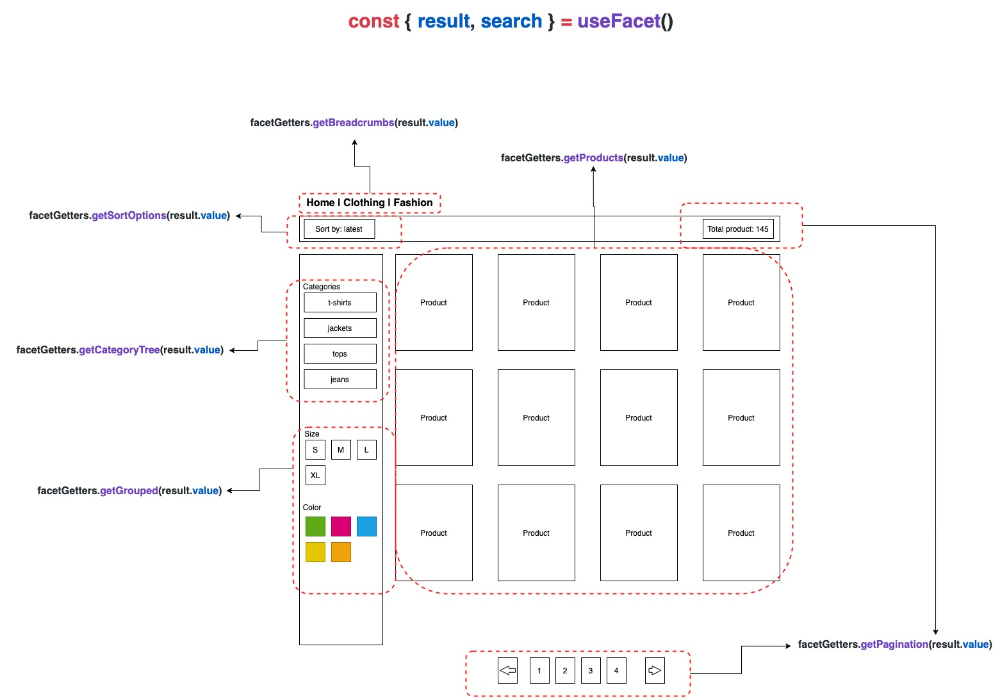

# `useFacet`

## What is faceting?
Faceting is the way of searching and classifying records, allowing users to browse the catalog data.
Each facet is the unit that refines the results over multiple dimensions at a time. Considering the clothing shop, we can distinguish multiple dimensions such as brand, size, color and so on. The particular value of that dimension is a facet, for example `color: red`, `size: xl etc`.

## Why do we need this?

When it comes to searching or browsing the results, faceting is the most common way of implementing this. Besides the ordinary commerce platforms, faceting is opening for us the way of integration with more search-advanced providers such as Algolia or Constructor.io.

## How faceting is related to the page?

In most cases faceting in eCommerce is a dedicated feature for browsing the catalog of products, usually on the category page / product listing page.

In Vue Storefront, we have implemented a couple of interfaces that covers that functionality. Each facet is represented by a single type called `AgnosticFacet` which also defines other types that are providing scoped functionalities such as pagination (`AgnosticPagination`), sorting (`AgnosticSort`), and more. For more details please look at the implementation in some of our integrations.




## How to use faceting in your project?

The usage of faceting is pretty straightforward. We have to only import `useFacet` composable from integration package you want to use. We provide also the set of usable getters that reads everything you need to browse the catalog. Below is the example of category page implementation:

```ts
setup (props, context) {
  const { result, search, loading } = useFacet();

  // the products that were found
  const products = computed(() => facetGetters.getProducts(result.value));

  // corresponding category tree
  const categoryTree = computed(() => facetGetters.getCategoryTree(result.value));

  // related breadcrumbs
  const breadcrumbs = computed(() => facetGetters.getBreadcrumbs(result.value));

  // sort options
  const sortBy = computed(() => facetGetters.getSortOptions(result.value));

  // available facets (grouped)
  const facets = computed(() => facetGetters.getGrouped(result.value));

  // pagination options
  const pagination = computed(() => facetGetters.getPagination(result.value));

  onSSR(async () => {
    // triggering a search based on criteria available in url query eg. ?colo=red&sortBy=latest
    await search(context.$router.history.current.query);
  });
}
```
<!-- 
## Integration strategy (only for integrators)

Are you the integration author? You in that case you need to implement `useFacet` using `useFacetFactory`.
It requires just one function `search` that is responsible for triggering the search.


```ts
import { useFacetFactory, FacetSearchResult } from '@vue-storefront/core';
import { facetingSearch } from '@vue-storefront/your-integration-api';

interface FacetResultsData {
  // ... your definition here
}

const factoryParams = {
  search: async (params: FacetSearchResult<FacetResultsData>): Promise<FacetResultsData> => {
    const sortBy = params.input.sortBy;
    const category = params.input.category;
    const color = params.input.color;
    const size = params.input.size;

    const facetResponse = await facetingSearch({ sortBy, category, color, size });

    return {
      result: facetResponse.data
    };
  }
};

export default useFacetFactory<FacetResultsData>(factoryParams);
```

The search params (`FacetSearchResult`) is a bit complex type. It contains both current result (`FacetSearchResult.data`) and just selected ones (`FacetSearchResult.input`). You actually should use mostly only `input` fields as a search params to the api, but you always have access to the current response in case you need to read something beforehand. That distinction was created to prevent blinks and achieve instant reaction in the UI - if you interact with the UI, firstly you modify the `input` and the `data` will be updated once response comes up. -->
