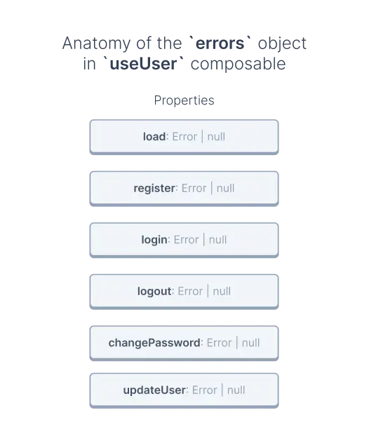

# Error handling

## Prerequisites

This guide assumes prior knowledge of composables. If you don't know what they are or how to use them, see the [Composables](./composables.html) guide.

## Errors flow

Most methods in composables don't directly throw errors when they fail. That's why you can't use `try...catch` block to catch errors.

```vue{7,10-15}
<script>
import { useUser } from '{INTEGRATION}';
import { useFetch } from '@nuxtjs/composition-api';

export default {
  setup() {
    const { load } = useUser();

    useFetch(async () => {
      // ❌ This try...catch block will never catch any errors
      try {
        await load();
      } catch(error) {
        //
      }
    });
  }
};
</script>
```

Instead, these errors are caught within the composable itself and exposed in a computed property called `errors`.

## Anatomy of the `errors` objects in composables

The `errors` objects in composables store last error thrown in each of the composable methods. Its keys match the names of the methods, and values contain an error or `null` if no errors were thrown.

Let's take a closer look at how it might look like using the [useUser](/reference/api/core.useuser.html) composable as an example:



In this example, the `errors` object has following properties:

- `load`,
- `register`,
- `login`,
- `logout`,
- `changePassword`,
- `updateUser`.

Each represents one method in `useUser` and initially all of them are `null`. However, if we call one of those methods and it fails, the value will change.

## Usage

Let's see how you can get error from the `load` method available in the [useUser](/reference/api/core.useuser.html) composable:

```vue
<script>
import { useUser, userGetters } from '{INTEGRATION}';
import { useFetch, computed } from '@nuxtjs/composition-api';

export default {
  setup() {
    const { load, errors } = useUser();
    const loadError = computed(() => errors.value.load);

    useFetch(async () => {
      await load();
    });

    return {
      loadError
    };
  }
};
</script>
```

Let's go step by step through this example to understand what's going on:

1. We begin by creating the `loadError` property, which extracts the `load` property from the `errors` object. Because there were no errors yet, its value is `null`.
2. Next, we call the asynchronous `load` method within the `useFetch` hook to load user data. When it fails, the `errors` object gets updated, which as a result, updates the value of the `loadError`` property.
3. Finally, we return the `loadError` property from the `setup` method to make it available in the components `<template>`.

You might have noticed that in step 1, we used the `computed` function.

That's because error properties are not reactive. You need to wrap them in `computed` functions to make them reactive.

```javascript
/**
 * ❌
 * Using `errors` property like this will only assign its values
 * once and never update, even when the value of the `errors` changes
 */
const nonReactive = errors.value.load;

/**
 * ✔️
 * Using the same property inside `computed` will observe
 * the changes in the `errors` object and update the variable
 */
const reactive = computed(() => errors.value.load);
```

### How to listen for errors?

Let's imagine you have some global component for error notifications. You want to send information about every new error to this component. But how do you know when a new error appears?
You can observe an error object with a watcher:

```ts
import { useUiNotification } from '~/composables';

const { cart, error } = useCart();
const { send } = useUiNotification();

watch(
  () => ({ ...error.value }),
  (error, prevError) => {
    // Handle error
  }
);
```

In this example, we are using `useUiNotification` - a composable that handles notifications state. You can read more about it in the API reference.
