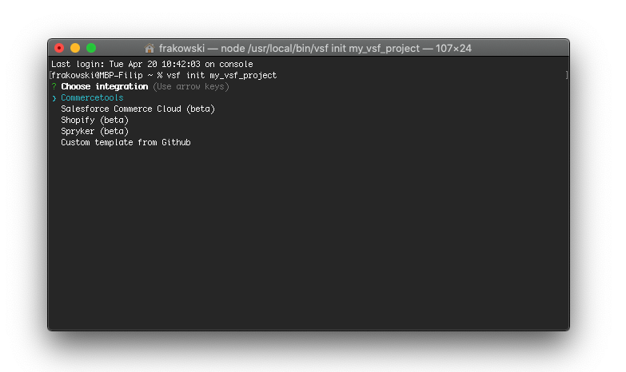

# Getting started

If you want to get started with Vue Storefront the easiest way to do this is to set up your project through our CLI tool.

To make use of Vue Storefront CLI simply install it globally through NPM:

```bash
npm i -g @vue-storefront/cli@next
```

Once installed you can use the CLI to set up the project with:

```bash
vsf init <project_name> 
```

Then you will be asked about the backend platform you wish to use. Once you choose it the CLI will create the project files in `<project_name>` directory. 

<center>
 
</center>

The only thing that's left before you can start developing is to install the dependencies:

```bash
cd <project_name> && yarn

// after dependencies are installed

yarn dev
```

## Non-standard installation

Vue Storefront can also be installed within already existing Vue and Nuxt codebases or without a boilerplate theme. Check out the platform-specific docs to learn how!

## What's next?

- Learn about key Vue Storefront concepts from other documents in `General` category.
- Check out the platform-specific docs in `eCommerce platforms` category to learn more about your integration.
