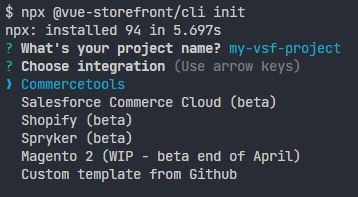

# Installation

## Prerequisites

Before proceeding, make sure you have [Node 10+](https://nodejs.org/en/) and [Yarn 1](https://classic.yarnpkg.com/lang/en/) installed.

## Using Vue Storefront CLI

The easiest way to get started with Vue Storefront is to set up your project using our CLI. You can run it using the `npx` command:

```bash
# Run Vue Storefront CLI
npx @vue-storefront/cli init
```
Enter the name of the project and select the backend platform you wish to use.

<center>
  
</center>

Once selected, the CLI creates the project files in the directory matching your project name. The only thing left is to go to this directory in the terminal and install the dependencies:

```bash
# Go to project folder
cd <project_name>

# Install required dependencies
yarn install
```

Now the project is ready. To start the application in development mode, use the `yarn dev` command:

```bash
# Start the project in development mode
yarn dev
```

You can read more about available commands and environments on [commands](https://nuxtjs.org/docs/2.x/get-started/commands/) page in Nuxt.js documentation.

## What's next?

- Learn about [key concepts in Vue Storefront](./key-concepts.html) to confidently work with your newly created Vue Storefront project.
- Check out the platform-specific docs in the `eCommerce platforms` category to learn more about your integration.
