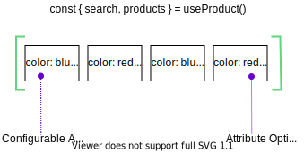

# Displaying products and categories

In Vue Storefront there are three composables available that you can use to show products and categories in your application - `useProduct`, `useCategory` and `useFacet`. In this chapter, you will learn in which situations you should use each of them.


## Fetching a single products variants with `useProduct`

`useProduct` composable is meant to be used primarily on Product Details Page to display information about a single product and its possible configurations.


Each unique combination of configurable product attributes such as color or size is called a _Product Variant_.

The `products` property is **always an array** of Product Variants.

<center>

</center>

```js
import { useProduct } from '@vue-storefront/{INTEGRATION}'
import { onSSR } from '@vue-storefront/core'

// in `setup`

const { products, search } = useProduct()

onSSR(async () => {
  await search(searchParams) // populates 'products' with the result
})
```

## Using `getFiltered` to select the Master Variant

Each of Product Variants in `products` array is a single product configuration.

In most of the eCommerce backends there is so-called _Master Variant_. You can think about this as a default configuration for your product that is displayed to the user if he/she havn't selected any other configuration yet.

We will use the `getFiltered` getter to filter out the other variants from the `products` object and keep only the one that we need:

```ts
import { productGetters } from '@vue-storefront/{INTEGRATION}'

// getFiltered: (products: PRODUCT[], filters?: PRODUCT_FILTER) => PRODUCT[];

const masterVariant = computed(() => productGetters.getFiltered(products.value, { master: true })[0]);
```

::: tip
Some platforms does not have a concept of Master Varaint. In such cases we're just treating the first configuration as one or creating a new one with `null` as attriibute option values which represent unconfigured product.
:::


## Using `getFiltered` to select the product configuration

The same way we've used `getFiltered` to select the Master Variant we can use it to select other variants.