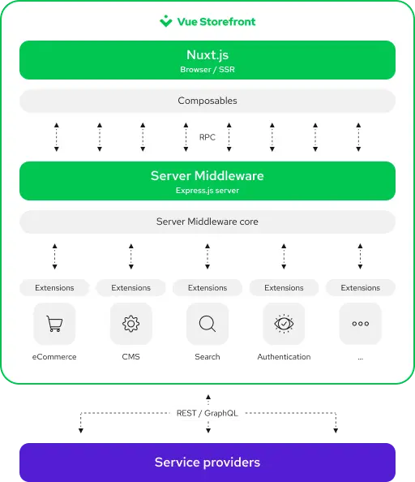

# Networking

Vue Storefront differs slightly from most applications in how it handles API communication. The most common way is for frontend applications to communicate directly with the API platforms (Service providers). However, in Vue Storefront, there is a "proxy" between them called Server Middleware.

## Data flow

Before we can understand Server Middleware, we need to discuss data flow from the user's browser all the way to the service providers. In Vue Storefront, three applications exchange the data:

* **Nuxt.js application** - requests data from the Server Middleware when specific methods in the [Application context](./application-context.html) or [Composables](/composition/composables.html) are called.
* **Server Middleware** - accepts requests from the Nuxt.js application, converts them, and sends them to the given platform in the proper format and communication technology.
* **Service providers** - expose API endpoints to fetch, add and remove data.

We describe each of them in more detail in the following sections.

:::tip There are exceptions
For security reasons, data is sometimes sent directly from the user's browser to the Service providers. For example, the payment and authentication integrations communicate directly with or redirect to the third-party websites so that sensitive customer information does not go through our servers.
:::

<figure style="text-align: center">
  
  <figcaption style="font-size: 0.9rem">(Click to zoom)</figcaption>
</figure>

### Nuxt.js

Most integrations in Vue Storefront ask you to register a Nuxt.js plugin or module in the `nuxt.config.js` file. These extend the [Application context](./application-context.html) and add special handlers that allow you to make API calls to the Server Middleware.

[Composables](/composition/composables.html) use the exact mechanism to communicate with their corresponding platforms when you call their methods.

### Server Middleware

Server Middleware is an Express.js server that exposes API endpoints defined in the extensions registered in the `middleware.config.js` file.

Extensions can prepare and send the requests to the service provider using available lifecycle hooks and data available in the request's body. When the response is received, it can be modified and sent back to the application. If necessary, extensions can also retry the request or make other subsequent requests to collect more data.

Server Middleware doesn't make any assumptions about the technologies used for the API communication. This way, integrations are not limited to specific protocols and can use whatever stack they see fit, be it REST, GraphQL, or anything else.

### Service providers

Server Middleware can communicate with various service providers as long as they expose an API. It can use industry-standard libraries like `axios` or `Apollo` or platform-specific JavaScript SDKs.

In some scenarios, when the traffic should not go through the Server Middleware, it's possible to communicate directly between the browser and platforms. However, keep in mind that adding necessary libraries to your frontend can negatively impact the performance.

## What's next

Now that we have a high-level overview of the architecture and how the Nuxt.js application, Server Middleware, and Service providers exchange the data, we can dive deeper. On the next page, we will learn about the [Application context](./application-context.html) and its use.
