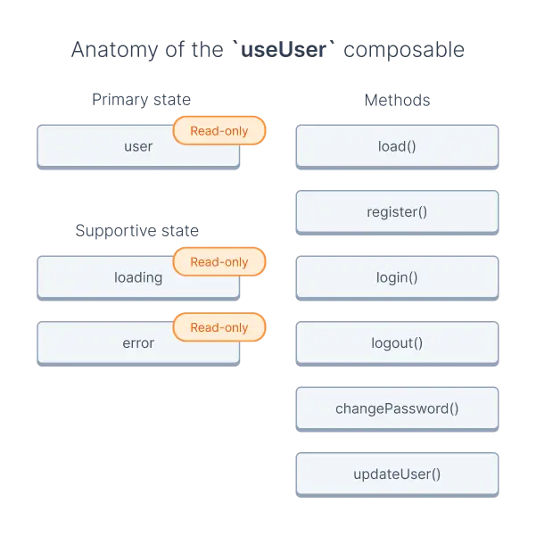
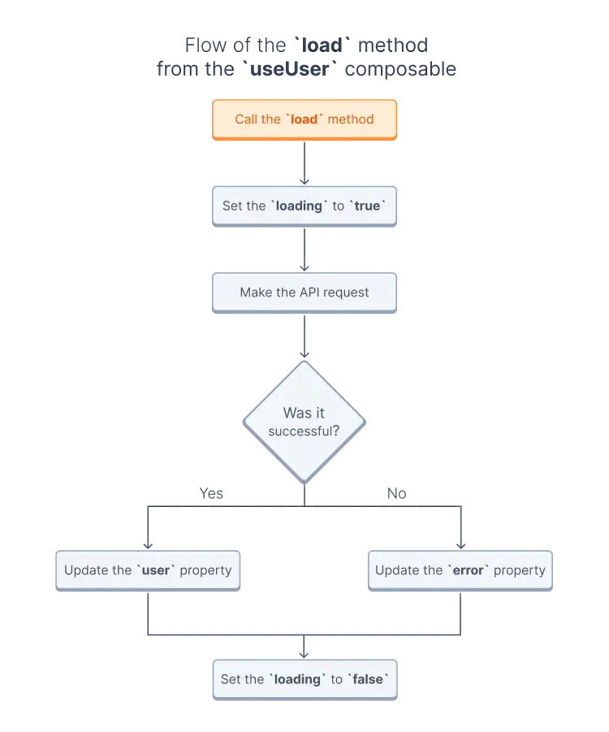

# Composables

## Prerequisites

Composables use the Composition API introduced in Vue 3 but also made available via plugins in Vue 2. If you are unfamiliar with it, see the official [Composition API FAQ](https://vuejs.org/guide/extras/composition-api-faq.html).

## What are composables?

Composables are functions with an **internal state** that changes over time and **methods** that modify this state. You cannot directly modify the state. The only way to change the state is by calling one of the composable's methods. However, because the state is reactive — thanks to Vue's Composition API — you can watch and react to these changes when necessary to update the UI or perform other operations.

This pattern encapsulates the state and business logic and exposes it through easy-to-use methods.

## Anatomy of a composable

Most composables consist of one or more of the following:

- **Primary state** - read-only state of the composable, which you cannot update directly.
- **Supportive state** - additional read-only state for values such as the status of the requests or errors.
- **Methods** - functions that update the primary and supportive states. These methods usually call API endpoints but can also manage cookies or call methods from other composables.

To make composables easily distinguishable from standard methods, we follow the popular convention of names starting with "use".

### What does it look like in practice?

Let's take a closer look at how it might look like using the [useUser](/reference/api/core.useuser.html) composable as an example:



In this example:

- the `user` property is the primary state,
- the `loading` and `error` properties represent the supportive state,
- the `load`, `register`, `login`, `logout`, `changePassword`, and `updateUser` are methods.

## Usage

Let's see how you can use the [useUser](/reference/api/core.useuser.html) composable to load the current user's data:

```vue
<script>
import { useUser } from '{INTEGRATION}';
import { useFetch } from '@nuxtjs/composition-api';

export default {
  setup() {
    /**
     * Extract needed methods and state variables from the composable
     */
    const { load, user } = useUser();

    /**
     * Load user data. The result will update the `user` object.
     */
    useFetch(async () => {
      await load();
    });

    /**
     * Return the `user` object to make it available in the template
     */
    return {
      user
    };
  }
};
</script>
```

While it's okay to destructure a composable like we did above, you should **not** destructure read-only states, such as the `user` or `error` properties. Doing it this way will create variables that are not reactive and don't update.

```javascript
/**
 * ❌
 * Destructuring `user` will create variables that
 * aren't reactive and don't update
 */
const { user: { value: { firstname } } } = useUser();

/**
 * ✔️
 * Using `computed` will make the variable react to
 * changes in the `user` object
 */
const { user } = useUser();
const firstname = computed(() => user.value.firstname);
```

This raises two questions:

1. What is the `useFetch`, and what does it do?
2. What happened when we called the `load` method?

### `useFetch` and other hooks for fetching data

There are many hooks available in Composition API, but let's only focus on the most common ones used for fetching data:

- The [useFetch](https://composition-api.nuxtjs.org/lifecycle/usefetch/) and [useAsync](https://composition-api.nuxtjs.org/API/useAsync) are Nuxt-specific hooks called on the server-side when rendering the route and on the client-side when navigating between pages.
- The `onMounted` is a lifecycle hook called **only on the client-side** after the browser loads the page.
- The `onServerPrefetch` is a lifecycle hook called **only on the server-side** when rendering the route.

You can use one or more hooks simultaneously, even in the same component.

### Internals of the `load` method

You might be wondering what happened within the composable when we called the `load` method in the example above. The behavior of methods is different between composables. Still, in the case of the `useUser` composable, the `load` method updated the `loading`, `error`, and `user` properties to reflect the current state, made an API call, and then updated the state with the API's response.



1. It set the `loading` property to `true`.
2. It called the corresponding API endpoint to load the current user's data.
   - if the request succeeded, it updated the `user` property,
   - otherwise, it added the error message to the `error` property.
3. It set the `loading` property to `false`.
