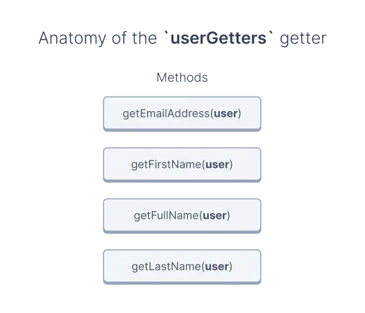

# Getters

## Prerequisites

This guide assumes prior knowledge of composables. If you don't know what they are or how to use them, see the [Composables](./composables.html) guide.

## What are getters?

Reading the same composable's data in a few places in your application can be cumbersome, especially if that data is deeply nested.

That's why every composable has a dedicated getter, which is a helper for extracting commonly used data. For example, the `useUser` composable has the `userGetters`.

You should use getters whenever possible unless the given getter doesn't have a method that returns the data you need.

## Anatomy of a getter

Getters are objects with a set of methods that accept either:

- the [primary state](./composables.html#anatomy-of-a-composable) from their composable,
- or result from other getter methods.

Let's take a closer look at how it might look like using the [userGetters](/reference/api/core.usergetters.html) as an example:



In this example, the getter has four methods:

- `getEmailAddress()`,
- `getFirstName()`,
- `getFullName()`,
- `getLastName()`.

Each accepts the `user` object from the `useUser` composable as a parameter.

## Usage

Let's see how you can use the [userGetters](/reference/api/core.usergetters.html) to get the user's full name:

```vue
<script>
import { useUser, userGetters } from '{INTEGRATION}';
import { useFetch, computed } from '@nuxtjs/composition-api';

export default {
  setup() {
    const { load, user } = useUser();

    /**
     * Create variable which extracts the full user name from the `user`
     * object. Until we load user data, the value is `undefined`.
     */
    const userFullName = computed(() => userGetters.getFullName(user.value));

    /**
     * Load user data. This updates the `user` object,
     * which as a result, updates the `userFullName` variable.
     */
    useFetch(async () => {
      await load();
    });

    /**
     * Return the `userFullName` object to make it available in the template
     */
    return {
      userFullName
    };
  }
};
</script>
```

You might have noticed that above, we called the getter function inside the `computed` function.

That's because getter methods are not reactive and don't observe changes in the values you pass. To make them reactive, you need to wrap them in `computed` functions.

```javascript
/**
 * ❌
 * Calling getter methods like this will only read their values
 * once and never update, even when the value of the `user` changes
 */
const nonReactive = userGetters.getFullName(user.value);

/**
 * ✔️
 * Wrapping the same method call inside `computed` will observe
 * the changes in the `user` object and re-run the getter method
 */
const reactive = computed(() => userGetters.getFullName(user.value));
```
