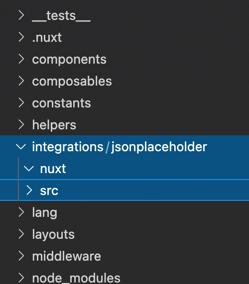

# Creating a simple custom integration

::: warning Want to build an integration?
If you want to integrate with Vue Storefront, don't hesitate to get in touch with the core team on our [Discord](https://discord.vuestorefront.io/) server. We are eager to help you to ensure its high quality and maybe even officially recommend it 😉
:::

Vue Storefront provides [out-of-the-box integrations](https://docs.vuestorefront.io/v2/integrations/) for various third-party solutions. However, sometimes your project might need to connect to a service that Vue Storefront does not integrate with by default.

For this case, you can leverage our default pattern to create your own integration and keep your project coherent!

This quick tutorial will guide you step-by-step through creating a simple integration with the [JSON Placeholder Free Fake API.](https://jsonplaceholder.typicode.com/)

## Locating custom integration code

Integrations delivered by Vue Storefront are installed in your project as dependencies. When it comes to creating your own integrations, the easiest solution would be to create a dedicated `/integrations` directory in the root of your project.

To kick off working with this tutorial, add the following directory structure to the root of your project (highlighted in blue):



## Creating custom integration module

The `nuxt` folder of your custom integration will contain its entry logic. This has two parts:

- a **plugin** injecting your integration's API methods into the global application context
- a **module** responsible for registering the plugin

Let's start with adding a simple `plugin.js` file:

```jsx
// integrations/jsonplaceholder/nuxt/plugin.js

import { integrationPlugin } from '@vue-storefront/core';

export default integrationPlugin(({ integration }) => {
  integration.configure('jsonplaceholder', { ...<%= serialize(options) %>})
});

```

Next, add an `index.js` file for your module:

```jsx
// integrations/jsonplaceholder/nuxt/index.js

import * as path from 'path';

export default function jsonplaceholder(moduleOptions) {
  this.addPlugin({
    src: path.resolve(__dirname, 'plugin.js'),
    options: moduleOptions,
  });
}
```

You're done with the `/nuxt` directory. At this point, your integration has no functionality, but you can already register it in your project!

## Registering custom integration

Every integration has to be registered in both `nuxt.config.js` and `middleware.config.js`.

First, register your newly-created module in `nuxt.config.js`:

```jsx
// nuxt.config.js

export default {
  buildModules: ['~/integrations/jsonplaceholder/nuxt'],
};
```

::: tip Why `buildModules` and not `modules`?

In this example, you've created a very simple module responsible only for registering your integration's plugin. It does it during the application build, therefore its code does not need to be included in the final bundle.

However, your integration's module could do way more that that. Visit the official Nuxt [documentation](https://nuxtjs.org/docs/directory-structure/modules/) to explore all capabilities of Nuxt modules and the difference between `modules` and `buildModules`.
:::

Secondly, add your integration's configuration in `middleware.config.js`:

```jsx
// middleware.config.js

const path = require('path');

module.exports = {
  integrations: {
    jsonplaceholder: {
      location: path.resolve(
        __dirname,
        'integrations/jsonplaceholder/src/index.server.js'
      ),
      configuration: {
        baseURL: 'https://jsonplaceholder.typicode.com/',
        // apiKey: '1234'
      },
    },
  },
};
```

In this example, the configuration only contains the `baseURL` property. However, if your integration requires sensitive credentials (like tokens or API keys), this is the right place to put them.

You might be wondering about the `location` part of the configuration since it references a file that doesn't exist yet. That location will be the `jsonplaceholder` integration's API client. let's set that up now.

## Creating an API client

Your integration needs an API client to communicate with third party APIs. For most services, you would use a client provided by their SDKs. This is what Vue Storefront does for the majority of our integrations (e.g. [Contentstack](https://www.contentstack.com/docs/developers/javascript-browser/api-reference/)).

For the JSON Placeholder Free Fake API, we're going to create a dedicated [axios](https://github.com/axios/axios) instance. Let’s start with adding an `index.server.js` file in `/integrations/jsonplaceholder/src`.

```jsx
// integrations/jsonplaceholder/src/index.server.js

const { apiClientFactory } = require('@vue-storefront/core');
const api = require('./api');
const axios = require('axios');

const setup = (settings) => {
  const { baseURL } = settings;

  const client = axios.create({ baseURL });

  return {
    config: {
      ...settings,
    },
    client,
  };
};

const { createApiClient } = apiClientFactory({
  onCreate: setup,
  api,
});

module.exports = { createApiClient };
```

The `setup` function is crucial because it's where we create our `axios` client. It receives the `baseURL` we specified in `middleware.config.js` and will be used by API methods in `/integrations/jsonplaceholder/src/api.js`. Let's create the file as the next step of this tutorial.


## Creating API methods

This example integration will have a single `searchTodos` API method that fetches [todos](https://jsonplaceholder.typicode.com/todos). Create a `/integrations/jsonplaceholder/src/api.js` file and add the method code there:

```jsx
// integrations/jsonplaceholder/src/api.js

const { Logger } = require('@vue-storefront/core');

module.exports.searchTodos = async (context, params) => {
  const { client } = context;
  let url = 'todos';

  if (params.id) {
    url += `/${params.id}`;
  }

  try {
    const response = await client.get(url);
    return Array.isArray(response.data) ? response.data : [response.data];
  } catch (err) {
    Logger.error('[jsonplaceholder] searchTodos failed.', error);
  }
};
```

As you can see, the `searchTodos` method receives two arguments:

1. an automatically injected `context` containing our API client created in the previous step,
2. a `params` object which can contain `id`. If it does, the API method will fetch a particular todo entry. If it does not, it will fetch all todos from the database.

The API method will use the previously created client to call the API and either return the received array of todos or log the error if it occurs. You should now be able to retrieve this method from the global application context and use it in your Vue components!

```vue
<template>
  <ul>
    <li v-for="todo in todos" :key="todo.id">
      <span>Title: {{ todo.title }}</span>
      <input type="checkbox" :checked="todo.completed" />
    </li>
  </ul>
</template>

<script>
import { useVSFContext, sharedRef, onSSR } from '@vue-storefront/core';

export default {
  setup() {
    const id = 1;
    const { $jsonplaceholder } = useVSFContext();
    const todos = sharedRef([], `todo-${id}`);

    onSSR(async () => {
      todos.value = await $jsonplaceholder.api.searchTodos({ id });
    });

    return {
      todos,
    };
  },
};
</script>
```

::: tip 💡 What is sharedRef?

[sharedRef](https://docs.vuestorefront.io/v2/reference/api/core.sharedref_1.html) is an internal helper which leverages Vue's [ref](https://vuejs.org/api/reactivity-core.html#ref) under the hood to create a new reactive property and persist its value fetched on the server side using the `onSSR` hook.

If you're not using `onSSR` and fetch your data on the client side, you can stick with the default [reactivity API](https://vuejs.org/api/reactivity-core.html) methods provided by `@nuxtjs/composition-api` package.
:::

## Creating composable methods

If your integration needs to do more than make API calls, you can add additional functionality inside composables. 


[Composables](https://docs.vuestorefront.io/v2/composition/composables.html) in Vue Storefront:

1. prepare and send the request to the API middleware (i.e., the corresponding API methods),
2. save (and modify if necessary) the response and manage the associated state.

In this example, the `jsonplaceholder` integration will contain a single composable called `useTodos` that returns:

- a `search` method that calls our `searchTodos` API method under the hood,
- a `todos` computed property,
- a `loading` computed property,
- an `error` computed property.

In `integrations/jsonplaceholder/src` create a `/composables` directory with a `/useTodos` directory nested inside. In `/useTodos`, create two files:

```jsx
// integrations/jsonplaceholder/src/composables/useTodos/index.js

import { Logger, useVSFContext } from '@vue-storefront/core';
import { sharedRef } from '@vue-storefront/core';
import { computed } from '@nuxtjs/composition-api';
import useTodosMethods from './useTodosMethods';

const useTodos = (id) => {
  const context = useVSFContext();
  const todos = sharedRef([], `useTodos-todos-${id}`);
  const loading = sharedRef(false, `useTodos-loading-${id}`);
  const error = sharedRef({ search: null }, `useTodos-error-${id}`);

  /**
   * Searches for todos with given params
   */
  const search = async (params) => {
    Logger.debug(`useTodos/${id}/search`, params);

    try {
      loading.value = true;
      todos.value = await useTodosMethods.search(context, params);
      error.value.search = null;
    } catch (error) {
      error.value.search = error;
      Logger.error(`useTodos/${id}/search`, err);
    } finally {
      loading.value = false;
    }
  };

  return {
    search,
    todos: computed(() => todos.value),
    loading: computed(() => loading.value),
    error: computed(() => error.value),
  };
};

export default useTodos;
```

```jsx
// integrations/jsonplaceholder/src/composables/useTodos/useTodosMethods.js

const useTodosMethods = {
  search: async (context, params) => {
    return await context.$jsonplaceholder.api.searchTodos(params);
  },
};

export default useTodosMethods;
```

Even though you could use a single `index.js` file, it’s a good practice to have two separate ones:

- `index.js` - manages the composable's state,
- `useTodosMethods.js` - stores the logic of the composable's methods (i.e. `search`).

Separating these will come in handy when creating composables with multiple methods and more complex logic.

Now, you can import the newly-created `useTodos` composable in your Vue components:

```vue
// pages/Home.vue
<template>
  <ul v-if="!loadingTodos && !todosError.search">
    <li v-for="todo in todos" :key="todo.id">
      <span>Title: {{ todo.title }}</span>
      <input type="checkbox" :checked="todo.completed" />
    </li>
  </ul>
</template>

<script>
import { onSSR } from '@vue-storefront/core';
import useTodos from '~/integrations/jsonplaceholder/src/composables/useTodos';

export default {
  setup() {
    const id = 1;
    const {
      todos,
      loading: loadingTodos,
      error: todosError,
      search: searchTodos,
    } = useTodos(id);

    onSSR(async () => {
      await searchTodos({ id });
    });

    return {
      todos,
      loadingTodos,
      todosError,
    };
  },
};
</script>
```

Congratulations! You've just created your first integration. Do not hesitate to show it to the Vue Storefront team to receive valuable feedback.
