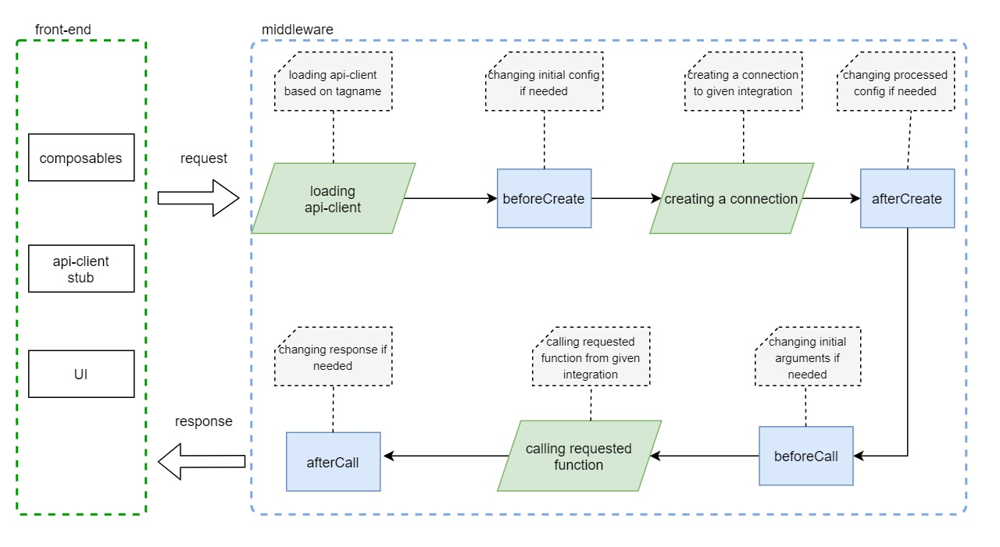

# Extending integrations

## Introduction

Server Middleware extensions allow to extend Express.js server, register additional API endpoints, or inject into the lifecycle of a request sent to a given Server Middleware integration from the application.

<center>
  
</center>

## Creating an extension

You can define as many extensions as you want. Each extension has the following structure:

```js
const extension = {
  name: 'extension-name',
  extendApiMethods: {
    async customMethod(context, params) => { /* ... */ }
  },
  extendApp: (app) => {  /* ... */ },
  hooks: (req, res) => {
    return {
      beforeCreate: ({ configuration }) => configuration,
      afterCreate: ({ configuration }) => configuration,
      beforeCall: ({ configuration, callName, args }) => args,
      afterCall: ({ configuration, callName, args, response }) => response
    }
  }
}
```

- `name` - defines the unique name of the extension
- `extendApiMethods` - overrides the original functions from API-client
- `extendApp` - a function that gives you access to the express.js app
- `hooks` - defines lifecycle hooks of API-client
- `hooks:beforeCreate` - called before API-client creates a connection. It accepts configuration as an argument, and must return it as well. You can use it to modify the configuration or merge with the default values.
- `hooks:afterCreate` - similar to the previous function, but called after the connection has been created. It accepts configuration as an argument, and must return it as well.
- `hooks:beforeCall` - called before each API-client function. We have access to the configuration, function name, and its arguments. This function must return the arguments, and based on the input parameters we can change it.
- `hooks:afterCall` - called after each API-client function. We have access to the configuration, function name, and its arguments. This function must return the response, and based on the input parameters we can attach something to it.

See the [ApiClientExtension interface](/reference/api/core.apiclientextension.html) for more information.

## Registering an extension

To register an extension, add it to the array returned from the `extensions` function of a given integration in the `middleware.config.js` file:

```js
module.exports = {
  integrations: {
    '{INTEGRATION_NAME}': {
      location: '{SERVER_INTEGRATION}',
      configuration: {},
      extensions: (extensions) => [
        ...extensions,
        {
          name: 'extension-name',
          hooks: () => { /* ... */ }
        }
      ],
      customQueries: {}
    }
  }
};
```

## Example: Adding new API endpoints

You cannot register new API endpoints directly but only through extensions to already registered integrations. Let's follow the examples above to add a new endpoint to the integration.

```js
module.exports = {
  integrations: {
    '{INTEGRATION_NAME}': {
      location: '{SERVER_INTEGRATION}',
      configuration: {},
      extensions: (extensions) => [
        ...extensions,
        {
          name: 'extension-name',
          extendApiMethods: {
            async customMethod(context, params) => { /* ... */ }
          }
        }
      ],
      customQueries: {}
    }
  }
};
```

Because this is an abstract example that applies to all integrations, we intentionally used `'{INTEGRATION_NAME}'` as the name of the integration. However, for the sake of example, let's assume it's `sloth`.

In such a case, registering the `customMethod` method in `extendApiMethods` would create a new `/api/sloth/customMethod` endpoint. This method accepts two parameters:

- `context` which includes:
  - `config` - integration configuration,
  - `client` - API client created in `packages/api-client/src/index.server.ts`,
  - `req` - HTTP request object,
  - `res` - HTTP response object,
  - `extensions` - extensions registered within integration,
  - `customQueries` - custom GraphQL queries registered within integration (used only with GraphQL),
  - `extendQuery` - helper function for handling custom queries (used only with GraphQL).
- `params` - parameters passed.

All HTTP requests to such endpoint must be POST, with arguments passed in an array:

```bash
curl '{SERVER_DOMAIN}/api/sloth/customMethod`' \
  -X POST \
  -H 'content-type: application/json' \
  -d '[{"query":"test","limit":20}]'
```
