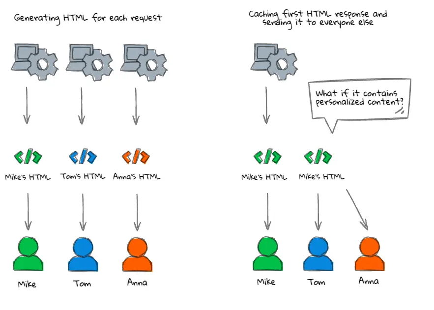
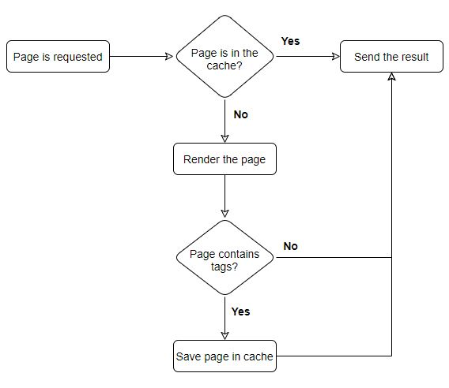

# Server Side Rendering Cache

## Introduction

Caching allows saving pages rendered on the server for later use to avoid computationally expensive rendering from scratch when possible. This is especially useful when the application has pages that require a lot of computation, make many API calls, or change infrequently. It not only reduces the load on the server but also significantly improves performance.

Caching SSR output in Vue Storefront requires two packages:

* `@vue-storefront/cache` - Nuxt.js module, that does the heavy lifting. It registers required plugins, creates [invalidation endpoint](#invalidating-tags), and hooks into the render cycle.
* **the driver** - thin layer on top of `@vue-storefront/cache` that integrates with specific caching solution, such as [Redis](https://redis.io/) or [Memcached](https://memcached.org/).

## Installation

### Add dependencies

```sh
yarn add @vue-storefront/cache
yarn add <DRIVER-NAME> # eg. @vue-storefront/redis-cache
```

### Configure Nuxt

The next step is to register Nuxt module from `@vue-storefront/cache` package in `nuxt.config.js` with driver and invalidation configuration.

::: warning Be careful
Make sure this package is added to the `modules` array, not `buildModules`.
:::

```javascript
// nuxt.config.js

export default {
  modules: [
    ['@vue-storefront/cache/nuxt', {
      enabled: process.env.VSF_REDIS_ENABLED === 'true',
      invalidation: {
        endpoint: '/cache-invalidate',
        handlers: [
          // Handlers
        ]
      },
      driver: [
        '<DRIVER NAME>',
        {
          // Driver configuration
        }
      ]
    }]
  ]
};
```

We can break down package configuration into three pieces:

* `enabled` (required boolean) - indicates if caching is enabled. The example above requires adding the `VSF_REDIS_ENABLED=true` configuration to the `.env` file to enable caching.
* `invalidation` (optional object) - contains URL to invalidate cache and array of invalidation functions. Refer to the [Invalidating cache](#invalidating-tags) section for more information.
* `driver` (array or string) - contains the path to or name of the driver package and its configuration. If the driver doesn't require any configuration, you can pass a string instead of an array. Refer to the documentation of the driver you use for more information.

### Update your project



This package doesn't check the application state before saving SSR output. For example, it doesn't check if the request comes from a logged-in user or not. It means that inappropriately using this package could lead to a leak of user-sensitive data. If the first request for the given page comes from the logged-in user and is later cached, all subsequent responses might include sensitive data of this user.

To prevent this, update your project to either:

* load **all** user-specific data only in the browser, using the `onMounted` hook,
* or don't use tags on pages and components that load user data.

### Add tags

If you follow the above steps and run the application, you won't see any performance difference. This is because only pages with tags are cached.

Refer to the [Tags](#tags) section for more information.

## How it works?

When the page is requested, the cache driver checks if there is an already rendered page in the cache matching the current route. If the rendered page exists, the cache driver will serve the cached version. Otherwise, the current page will be rendered on the server and served to the user, but if it contains tags, the result will be saved in the cache and used for subsequent requests.



## Tags

Tags are strings associated with the rendered page and represent elements of the page that are dynamic and can change in the future. Each tag consists of a prefix and a unique ID associated with the dynamic element.
For example category with the ID of 1337 would create a tag `C1337`.

A typical category page would have tags for:

* current category,
* all visible subcategories,
* all visible products.

### Why we need tags?

When at least one tag associated with the given page is [invalidated](#invalidating-tags), the whole page is removed from the cache and will be rendered from scratch on the next request. For example, if one of the products is modified or disabled, we should invalidate cache for pages where this product is visible:

* Product page for this particular product.
* Other product pages where this product is listed (upsell or cross-sell).
* Homepage, if the product is displayed in the carousel or listed as a popular item.
* Category page, where this product is listed.
* Search page where this product is part of the results.

Additionally, all modifiers changing what is displayed on the page, such as pagination, filtering, and sorting options, should be added as URL queries (for example, `?sort=price-up&size=36&page=3`). This will cause different modifier combinations to be treated as different routes, and thus, cached separately.

### Using tags

Tags should be registered in Vue components or composables. During Server Side Rendering, tags registered in the current route are associated with the rendered page.

To add tags, use `useCache` composable from `@vue-storefront/cache` package.

```javascript
// pages/Category.vue
import { onSSR } from '@vue-storefront/core';
import { useCache, CacheTagPrefix } from '@vue-storefront/cache';

export default {
  setup() {
    const { addTags } = useCache();

    onSSR(() => {
      addTags([
        { prefix: CacheTagPrefix.View, value: 'category' },
        { prefix: CacheTagPrefix.Category, value: id },
        // or
        { prefix: 'V', value: 'category' },
        { prefix: 'C', value: id },
      ]);
    })
  }
};
```

### Invalidating tags

::: tip
Check the documentation for your e-commerce integration to see if it provides any invalidation handlers.
:::

::: warning WARNING
The `@vue-storefront/cache/nuxt` module doesn't automatically invalidate tags. You must configure your CMS and e-commerce platforms to call the invalidation endpoint whenever content changes.
:::

As mentioned in [Installation](#installation) section, `@vue-storefront/cache` module provides option to create invalidation endpoint.

Because each integration may pass data in a different format or multiple invalidation strategies may be needed at the same time, we need **invalidation handlers**. Each handler may return tags, which are later combined and passed to the driver for invalidation.

Internally `prefix` and `value` provided to `addTags` method are combined into one string, so `{ prefix: 'V', value: 'category' }` becomes `Vcategory` and `{ prefix: 'C', value: 1337 }` becomes `C1337`.

```javascript
invalidation: {
  endpoint: '/cache-invalidate',
  handlers: [
    // Integration specific handlers
  ]
}
```

#### Default invalidation handler

`@vue-storefront/cache` package provides a default handler that can be enabled using following configuration:

```javascript
['@vue-storefront/cache/nuxt', {
  invalidation: {
    endpoint: '/cache-invalidate',
    key: 'uniqueKey',
    handlers: [
      '@vue-storefront/cache/defaultHandler'
    ]
  },
  driver: [
    // driver configuration
  ]
}]
```

To invalidate the cache using it, visit an URL provided in the configuration with two query strings:

* `key` - specified in the configuration and used to prevent unauthorized users from clearing the application's cache. For this reason, you should use long and hard-to-guess keys.
* `tags` - comma (`,`) separated tags to be invalidated.

Using settings above and default Vue Storefront configuration, the invalidation URL should look like this:

```text
http://localhost:3000/cache-invalidate?key=myUniqueKey&tags=Vcategory,C1337
```

To invalidate all keys, pass `*` as a `key` value:

```text
http://localhost:3000/cache-invalidate?key=myUniqueKey&tags=*
```

#### Creating an invalidation handler

Invalidation handler is a function that returns an array of tags. It accepts an object with the following properties:

* `request` (object) - Node.js HTTP request object;
* `response` (object) - Node.js HTTP response object;
* `options` (array) - `invalidation` object in `@vue-storefront/cache/nuxt` configuration;

```javascript
function ({ request, response, options }) {
  // Get tags from the "request" object
  return tags;
};
```

The handler should prevent unauthorized users from clearing the cache. One way of doing it is adding `key` to the configuration like in the [default invalidation handler](#default-invalidation-handler) and checking if `request` contains `options.key` in the URL queries or body.

::: tip Don't throw errors in handlers
Because multiple handlers can be used at the same time to add support for different data formats, they should not throw errors. Throwing an error from the handler drops the request, which may be processed by another handler.

If one of the properties is missing or the validation key is wrong, return an empty array.
:::

## What's next

* Check out ready to use [Redis cache integration](../integrations/redis-cache.html).
* Check how you can [build your own cache driver](../integrate/cache-driver.html).
