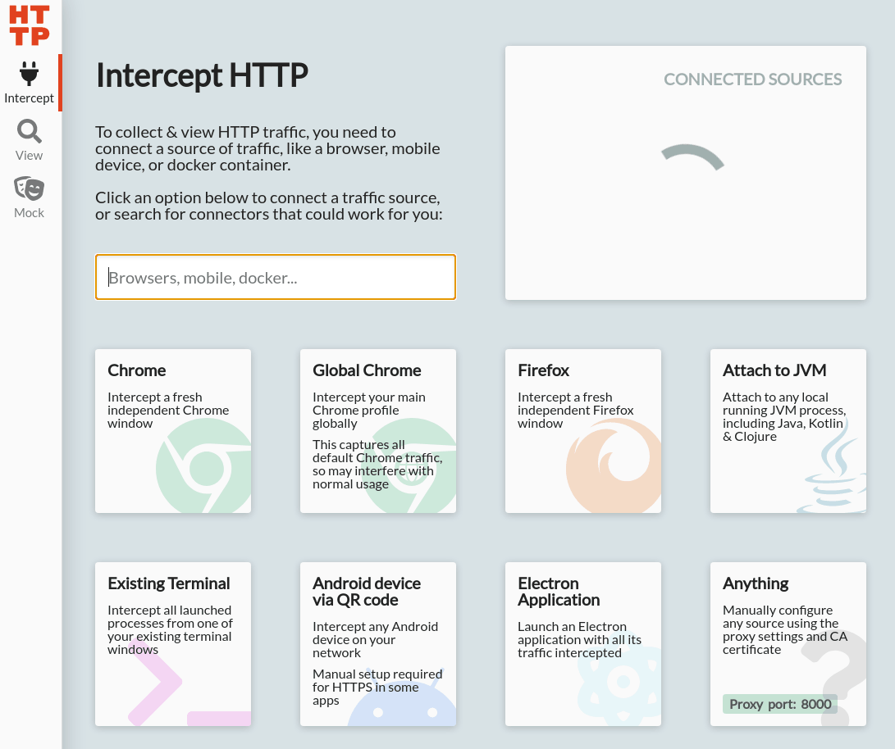

# Inspecting network requests

Although you can inspect the network request sent from the client (browser) to Server Middleware using built-in browser devtools, it is more complicated to inspect requests sent from the Server Middleware to external services. This document shows how to do it using a GUI tool called HTTP Toolkit.

## Intercepting with HTTP Toolkit

Go to the [HTTP Toolkit website](https://httptoolkit.tech/) and download a version for your operating system. The tool is available for Windows, Linux, and macOS.

:::warning Using HTTP Toolkit on WSL2
WSL2 on Windows 11 has native support for GUI applications, and there are no additional steps required.

However, WSL2 on Windows 10 requires XServer to run applications with GUI.
:::

Once downloaded and installed, run the HTTP toolkit binary/exec file.

```shell
./httptoolkit
```

Then, open the "Intercept" tab in HTTP Toolkit, and select the "Existing Terminal" tab. It will download a script configuring the terminal session and instructing Node to send its traffic via proxy.

<center>
  
</center>

Run the following command displayed after clicking on the "Existing Terminal" tab.

```shell
. <(curl -sS localhost:8001/setup)
```

Finally, start the application **in the same terminal window**.

```shell
yarn dev
```

If you open the page in the browser, HTTP Toolkit should intercept requests and show them in the "View" tab.
