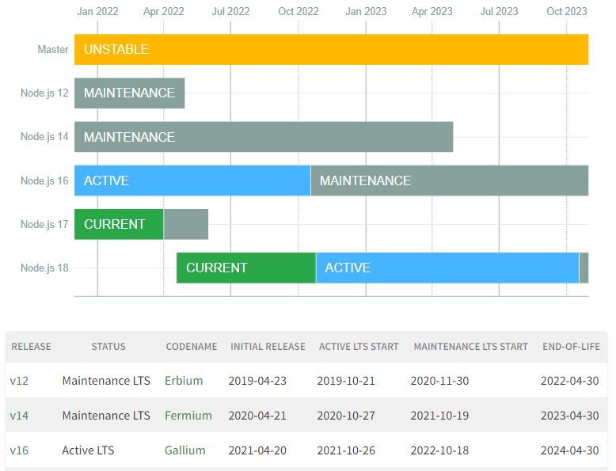
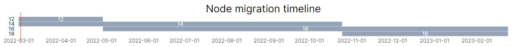

# Supported Node versions

| Status                  | Proposed
:------------------------ |:----------------------------------------------------
| **Author(s)**           | Filip Sobol
| **Created**             | 2022-03-02
| **Affected package(s)** | Core, boilerplate and all integrations
| **Target version(s)**   | TBD
| **Reference issues**    | -
| **Implementation PR**   | TBD

## Summary

Node 12 is reaching its End-of-Life, and we need to upgrade our ecosystem to a newer version to ensure stability and security.

## Motivation

Since the beginning of Vue Storefront 2, we recommended using Node 12 and only recently changed it to "Node 12 or 14" in our [Installation](https://docs.vuestorefront.io/v2/general/installation.html) guide.

Unfortunately, Node 12 will reach its End-of-Life by 2022-04-30 and no longer receive any stability and security updates. Additionally, we don't have any process for upgrading Node versions, and the supported Node version is dictated by every integration separately.

This RFC addresses all three issues.



## Proposal

To make our upgrade cycle more predictable and ensure stability and security, I suggest that we always **support the current and previous LTS versions of Node**. This means that we will support each version for 2 years according to the current Node.js release schedule:

* 1 year in "Active" status,
* 1 year in "Maintenance" status.

At this moment, we are behind this schedule, but we can support:

* version 12 and 14 until 2022-04-30 (Node 12 End-of-Life),
* version 14 and 16 from 2022-04-30 to 2022-10-25 (Node 18 release date),
* version 16 and 18 from 2022-10-25 to 2023-10-24 (Node 20 release date),
* and so on...

Once we sync with the Node release schedule (starting 2022-10-25), developers will have one year to upgrade their project whenever a new LTS is released.

We should enforce this requirement in all official integrations and plugins.



## Who's affected

Supported Node version is dictated by every integration separately. A notable exception is the Magento integration, which [already requires at least Node 16](https://github.com/vuestorefront/magento2/blob/main/packages/theme/package.json#L101-L103). This means that all other integrations will need to be tested and upgraded according to [Development work](#development-work) section below.

I tested the [Boilerplate](https://github.com/vuestorefront/ecommerce-integration-boilerplate) and commercetools projects using Node 16 and encountered only one deprecation warning (more specifically deprecation warning reported by Nuxt.js as an error) described in [this issue](https://github.com/vuestorefront/vue-storefront/issues/6556).

This deprecation warning can be ignored and will be fixed in core version 2.6.0.

However, there might be problems in the upgrade process in bigger projects that use many external packages and libraries, which we have no control over.

## What should I do as...

### a Developer

If you have a Vue Storefront project, we would like to ask you to test it on Node 16 and let us know if you face any issues. This will help us identify common problems and, if nedded, postpone the migration.

We encourage you to start using Node 14 before 2022-05-02 and be prepared to migrate to Node 16 before 2022-10-25.

To upgrade your project, follow these few steps:

* Update Node version locally. If you use various Node versions in your projects, we recommend tools like [nvm](https://github.com/nvm-sh/nvm) and [n](https://www.npmjs.com/package/n) to quickly switch between them.
* Update Node version used in deployments (e.g., in `Dockerfile`).
* Update Node version used in CI/CD scripts (e.g., scripts in `.github/workflows` directory, if you use GitHub Actions).
* Add `engines` to the `package.json` file to prevent running older versions by mistake:

  ```json
  {
    "engines": {
      "node": ">=14.x"
    }
  }
  ```
 
* Test your project, especially the parts that are heavily customized or that use 3rd party dependencies not present in Vue Storefront by default. We tested new projects and cannot guarantee that anything added to them will also work.

### an Integrator

If you have a project based on our [Boilerplate](https://github.com/vuestorefront/ecommerce-integration-boilerplate), we recommend:

* if you are using GitHub Actions, use the `matrix` strategy to test your integration against Node 14 and 16. [See the example](https://docs.github.com/en/actions/using-workflows/workflow-syntax-for-github-actions#example-running-multiple-versions-of-nodejs).
* adding this to the `package.json` files in the root of your project and inside `packages/theme`:

  ```json
  {
    "engines": {
      "node": ">=14.x"
    }
  }
  ```

Additionally, if you are creating an integration that was not released yet, we recommend upgrading to Node 16 immediately. This way, you don't have to migrate in the following few months. In this case, change the versions in GitHub Actions and both `package.json` files accordingly.

## Development work

From a developers perspective, projects must be:

* tested against and upgraded to Node 14 before 2022-04-30,
* tested against and upgraded to Node 16 before 2022-10-25,

From the maintainers perspective, projects must be:

* tested against and made compatible with Node 14 as soon as possible,
* tested against and made compatible with Node 16 before 2022-04-30,
* tested against future LTS versions (6 month window, between "Initial release" and "Active LTS start"),
* upgraded to new LTS every one year,
* tested against current and previous LTS and require at least previous LTS starting 2022-04-30.
